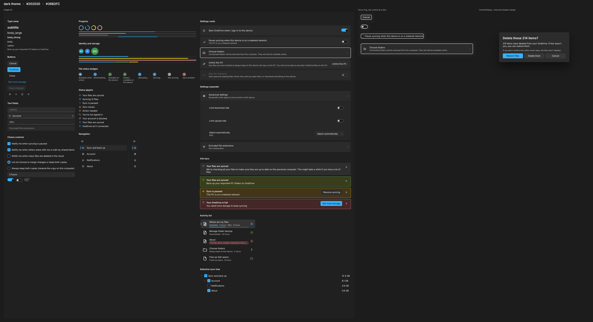
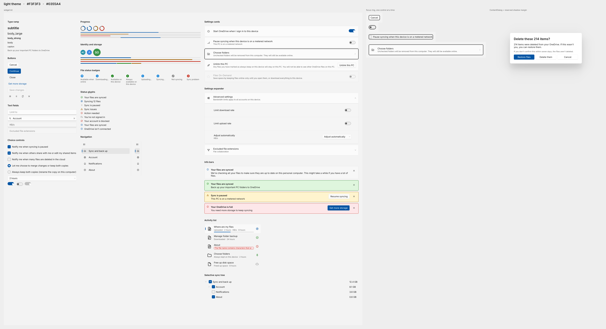

# OneDriveUI — a OneDrive client for Linux, with a real GUI

**OneDrive sync for Linux** with the thing every other option is missing: a graphical client that
behaves like the one on Windows. Tray icon, Files On-Demand, file-manager integration, notifications,
a setup wizard — a faithful reproduction of the **Microsoft OneDrive client for Windows 11**, its
features and its wording, on top of **[rclone](https://rclone.org)** as the sync engine.

[](#license)
[](#compatibility)
[](#compatibility)
[](#compatibility)
[](#status-alpha)



Works with **OneDrive Personal** and **OneDrive for Business / Microsoft 365**. Free and open source,
no account beyond your Microsoft one, nothing phones home.

---

## Table of contents

- [Install in three commands](#install-in-three-commands)
- [What you get](#what-you-get)
- [Compatibility](#compatibility)
- [Requirements](#requirements)
- [Full install guide](#full-install-guide)
- [Command line](#command-line)
- [How it compares](#how-it-compares)
- [FAQ](#faq)
- [How it works](#how-it-works)
- [Safety](#safety)
- [Known limitations](#known-limitations)
- [Development](#development)

---

## Status: alpha

All fifteen work packages are built and the client works against a real account, but:

- **28 of the 4303 tests currently fail.** They are the ones that still assert against three modules
  the last refactor deleted and against signatures it changed — `test_supervisor`, `test_contracts`,
  `test_config` and their neighbours. Known, catalogued, not yet rewritten.
- It has not been through the 24-hour stress run, and the Nautilus integration has not been exercised
  in a long real session.

Read [`docs/PENDING.md`](docs/PENDING.md) before trusting it with anything you cannot lose.

---

## Install in three commands

```bash
git clone https://github.com/Danielxpj/OneDriveUI
cd OneDriveUI
./scripts/install.sh
```

The installer looks at your distribution, checks the five things `pip` cannot install (rclone,
PySide6, PyGObject, fuse3, nautilus-python), and — if any is missing — **prints the exact package
command for your distribution and offers to run it for you**. Nothing is installed without your
answer. Then:

```bash
nautilus -q      # Nautilus does not reload extensions while it is running
onedriveui       # first run opens the setup wizard, which signs you in
```

Want to look before you leap? `./scripts/install.sh --check` reports what is missing and changes
nothing.

---

## What you get

| Surface | What it does |
|---|---|
| **Tray icon** | A StatusNotifierItem with ten distinct states and an eight-frame spinner — synced, syncing, paused, offline, error, and the rest |
| **Files On-Demand** | `rclone mount --vfs-cache-mode full` plus a real pin table: **online-only**, **locally available**, **always keep on this device** — the same three states Windows has |
| **Activity Center** | The 360 px flyout, as a normal window: what is uploading, what failed, what changed |
| **Settings** | 1024×720, five pages: Sync, Account, Notifications, rclone engine, About — including the 28 mount parameters, with the exact command line they produce |
| **File manager** | Emblems, a **Status** column and a OneDrive submenu in **Nautilus** (GNOME Files) |
| **Notifications** | Desktop toasts with action buttons, over `org.freedesktop.Notifications` |
| **First run** | A seven-page setup wizard: sign in, pick a folder, choose what syncs — Windows' nine screens minus the three that happen inside the browser |
| **Command line** | `--state`, `--status`, `--doctor`, `--pause`, `--diagnostics` — the same engine, headless |



---

## Compatibility

### Linux distributions

The installer knows the package names for all of these. Anything with Python 3.12+, rclone 1.75+ and
its own PySide6/PyGObject packages will work; the table is about how much hand-holding you get.

| Distribution | Installer support | Notes |
|---|---|---|
| **CachyOS**, Arch Linux | ✅ tested daily | the development machine |
| EndeavourOS, Manjaro, Garuda | ✅ same packages | Arch family, detected via `ID_LIKE` |
| **Ubuntu** 24.04+, Debian 13+ | ✅ package names shipped | needs distro PySide6 (`python3-pyside6.*`); older releases ship an rclone below 1.75 |
| Linux Mint, Pop!\_OS, Zorin | ✅ same packages | Debian/Ubuntu family |
| **Fedora** 40+, Nobara | ✅ package names shipped | `python3-pyside6`, `nautilus-python3` |
| RHEL, Alma, Rocky 10+ | ⚠️ same names, untested | needs Python 3.12+ |
| **openSUSE** Tumbleweed | ⚠️ names shipped, untested | Leap's Python may be too old |
| Void, Alpine, Gentoo | ⚠️ names shipped, untested | Alpine has no `nautilus-python` package |
| Anything else | ℹ️ works, no auto-install | the installer prints the requirement, you install it |
| **NixOS, immutable/atomic (Silverblue…)** | ❌ not supported by the script | the venv-plus-system-packages model does not fit; a Nix expression or a toolbox is needed |

### Desktop environments

| Desktop | Tray icon | Rest of the app |
|---|---|---|
| **GNOME 45+** | ✅ with the [AppIndicator extension](https://extensions.gnome.org/extension/615/appindicator-support/) — GNOME has no native tray | ✅ tested on GNOME 50.4 |
| **KDE Plasma 5/6** | ✅ native StatusNotifierItem host | ✅ expected to work, untested |
| XFCE, Cinnamon, MATE, Budgie | ✅ with an SNI-capable panel | ✅ expected to work, untested |
| Sway, Hyprland, river | ✅ via Waybar/eww SNI module | ✅ expected to work, untested |
| No tray at all | — | ✅ the client detects it and opens the Activity Center window instead |

**Wayland** is what this was built on; **X11** works and is in fact less restricted (only the
flyout-anchoring limitation is Wayland's).

### Everything else

| | Supported |
|---|---|
| **Account types** | OneDrive **Personal**, OneDrive for **Business** / Microsoft 365. Multiple accounts at once |
| **File manager** | Nautilus 4.x (emblems + Status column). Dolphin, Nemo, Thunar: the app runs fine, you just get no emblems |
| **Init system** | **systemd required** — the two rclone services run as `systemd --user` units, with restart ladders and ownership proofs |
| **Architecture** | x86_64 tested; aarch64 expected to work (no compiled code of our own) |
| **Python** | 3.12, 3.13, 3.14 (developed on 3.14.7) |
| **rclone** | 1.75.0 or newer — the rc API this is written against |
| **PySide6 / Qt 6** | your distribution's build, 6.7+ (developed on 6.11.2) |

Reference environment: CachyOS, GNOME Shell 50.4 on Wayland, Python 3.14.7, PySide6 6.11.2,
rclone v1.75.0.

---

## Requirements

Five things `pip` cannot install correctly. The installer checks each one, explains it, and offers to
install it:

| | Why pip cannot do it |
|---|---|
| **rclone** ≥ 1.75 | a Go binary. The whole sync engine |
| **PySide6** | the PyPI wheel ships its own Qt and *shadows* the system one. The symptom is not an import error — it is a tray icon that registers no StatusNotifierItem |
| **PyGObject** | the same problem, against the system GLib. It carries the notifications and the network and power monitors |
| **fuse3** | `rclone mount` is a FUSE filesystem; `fusermount3` is what mounts it |
| **nautilus-python** 4.1 | optional. Without it everything works except the file-manager emblems and the Status column |

Plus **Python ≥ 3.12**. On Arch / CachyOS that is:

```bash
sudo pacman -S rclone pyside6 python-gobject fuse3 nautilus-python
```

...but you do not have to type it: the installer prints the right line for *your* distribution.

---

## Full install guide

```bash
./scripts/install.sh              # check, offer to install deps, then install
./scripts/install.sh --check      # report only; change nothing
./scripts/install.sh --yes        # answer yes to the dependency prompts
./scripts/install.sh --no-deps    # never touch system packages
./scripts/install.sh --uninstall  # remove everything this script installed
./scripts/install.sh --help       # the long explanation
```

What a normal run does, in order:

1. **Reads the machine** — distribution, package family, session type, Python version.
2. **Checks the dependencies** and, for each missing one, says *what breaks without it*. If your
   distribution ships an rclone older than 1.75, it offers rclone's own official installer instead.
3. **Creates `.venv` with `--system-site-packages`.** That flag is the whole reason this script
   exists: the venv has to *borrow* the distro PySide6 and PyGObject rather than install its own.
   A venv that cannot see them is detected and rebuilt.
4. **`pip install -e .`** — editable, so a `git pull` updates the app with no reinstall.
5. **Links `~/.local/bin/onedriveui`**, and warns you if that is not on your `PATH`.
6. **Installs the Nautilus extension**, 27 icons and the `.desktop` entry.
7. **Runs `--doctor`** and prints the verdict.

It does **not** enable autostart, run the wizard, sign you in, or mount anything. A dead daemon and
no mount in that final self-check are expected on a fresh install — the wizard starts both.

Uninstalling removes the extension, the icons, the launcher and the venv, and **leaves your config,
your database, your `rclone.conf` and your files exactly where they are.**

---

## Command line

```
onedriveui                    the GUI
onedriveui --state            one word: the current sync state
onedriveui --status           the whole snapshot, as JSON
onedriveui --doctor           every self-check, and what is wrong
onedriveui --diagnostics PATH a redacted bundle for a bug report
onedriveui --pause [HOURS]    pause syncing (2, 8, 24, or until you resume)
onedriveui --open-folder      open the sync root
onedriveui --settings         open Settings
onedriveui --install-extension / --uninstall-extension
```

`--state`, `--status` and `--doctor` run the *whole engine* headless — the same fact collector, the
same reducer — so their answer is the answer the tray is showing, not a separate guess made for the
command line. That makes them safe to put in a status bar or a script.

---

## How it compares

| | GUI | Files On-Demand | Engine | Cost |
|---|---|---|---|---|
| **OneDriveUI** | ✅ tray, Activity Center, Settings, Nautilus | ✅ online-only / pinned | rclone | free, MIT |
| `abraunegg/onedrive` | ❌ CLI + third-party GUIs | ❌ full local copy (or selective sync) | its own | free, GPL |
| OneDriver | ⚠️ minimal launcher | ✅ FUSE, on-demand by design | its own | free, GPL |
| rclone alone | ❌ CLI | ✅ with `mount --vfs-cache-mode` | rclone | free |
| Insync | ✅ | ⚠️ partial | proprietary | paid |

The honest summary: if you want a **command-line OneDrive sync daemon**, `abraunegg/onedrive` is
mature and battle-tested. OneDriveUI exists because nothing on Linux reproduces the *desktop
experience* — the tray, the per-file status in the file manager, the pin states, the wording.

---

## FAQ

**Is there an official Microsoft OneDrive client for Linux?**
No. Microsoft ships OneDrive for Windows and macOS only. Everything on Linux is third party, this
included.

**Does this work with OneDrive for Business / Microsoft 365?**
Yes — Personal and Business/Work-or-School accounts, and more than one at a time. Sign-in is
rclone's normal OAuth flow in your browser; the token lives in `~/.config/rclone/rclone.conf` and is
never logged.

**Does it download my whole OneDrive?**
No. Files On-Demand is the default: files are listed but not downloaded until you open them, and you
can pin a file or a folder as *always available* or push it back to *online-only*, exactly as on
Windows.

**Does it work on Ubuntu / Fedora / KDE?**
See [Compatibility](#compatibility). The short version: any distribution with Python 3.12+ and
rclone 1.75+, and any desktop with a StatusNotifierItem host — which on GNOME means the AppIndicator
extension, and on KDE Plasma means nothing extra.

**Do I need to know rclone?**
No. The wizard signs you in through rclone's normal browser OAuth and writes the remote itself —
there is no in-app password field, on purpose. If your `rclone.conf` already has OneDrive remotes,
the client picks them up as accounts. And for people who *do* want the knobs, the **rclone engine**
page in Settings exposes the mount parameters and shows the exact command line it will run.

**Is my data safe?**
Fifteen invariants are enforced in code and cannot be overridden by config — see [Safety](#safety).
Deletions this app performs go to the freedesktop Trash, never `unlink()`. Nothing is sent anywhere
except Microsoft's own API, by rclone.

**How do I report a bug?**
`onedriveui --diagnostics /tmp/bundle.zip` writes a zip with the logs, the versions and both configs,
every member passed through the redactor so no token or credential goes with it. Attach it to
[an issue](https://github.com/Danielxpj/OneDriveUI/issues).

---

## How it works

Three processes, each doing one job:

```
onedriveui                     the GUI. Owns no sync state; renders one.
  │
  ├── onedriveui-rcd.service          rclone rcd — the control plane
  │                                   config, token, quota, remote listings
  │
  └── onedriveui-mount@<acct>.service rclone mount — the data plane
                                      the VFS, the cache, the transfers
```

**The governing design principle** is that every visible surface is a projection of one derived state.
The tray icon, the tooltip, the Activity Center status line, the Settings badges and the Nautilus
emblems all read from a single `SyncState`, produced by one pure reducer over one immutable `Facts`
snapshot. The tray cannot say "synced" while the flyout says "paused" — they are the same value
rendered twice.

**The governing safety principle** is that nothing authoritative lives in memory. Your *intent* lives
in `config.json`; latched hazards and history live in SQLite; everything else is re-observed each tick
from the kernel (`/proc/self/mounts`, `statvfs`, inotify), from rclone's rc API, or from rclone's own
on-disk state. A `SIGKILL` of the GUI loses nothing.

Every tick, a `FactCollector` reads ten named sources within a 1500 ms budget — a source that misses
its budget carries its previous value forward and is marked *stale* rather than inventing one. The
resulting immutable `Facts` goes through a 17-rung first-match-wins ladder that is pure and
clock-free, and a debouncer with per-state hysteresis decides whether the answer is stable enough to
show. Every world-changing action goes through one method, `Supervisor.do(action, **kw)`.

The full design is in [`docs/ARCHITECTURE.md`](docs/ARCHITECTURE.md); the frozen interfaces are in
[`docs/CONTRACTS.md`](docs/CONTRACTS.md).

---

## Safety

Fifteen hard invariants are enforced in code by `onedriveui/rc/guards.py`, which raises
`SafetyRefusal`. None is overridable by config. A few, to show what kind of rule they are:

- **I1** — no `--onedrive-*` flag on any rclone command line. A backend override on the command line
  renames the fs to `onedrive{HASH}:` and silently relocates the entire VFS cache, turning every
  materialised file online-only.
- **I3** — nothing whose VFS sidecar is `Dirty` may be evicted, force-unmounted or bisync'd around.
  A dirty cache item is a local change that exists nowhere else.
- **I8** — `operations/cleanup` is never called. On OneDrive it deletes *file versions*, not the
  trash, contradicting its own help text.
- **I10** — every local deletion this app performs goes to the freedesktop Trash, never `unlink()`.
- **I15** — `--resync` is never run on a schedule; it requires an answered decision. A scheduled
  resync resurrects deleted files forever.

The full table, with the failure each one prevents, is §3 of `docs/ARCHITECTURE.md`.

---

## Known limitations

Honest gaps, each with a cause that is not fixable from here:

| Gap | Why |
|---|---|
| Remote changes take ~60 s to appear | `ChangeNotify` has no rc endpoint; it is consumed only by the VFS. Windows is push-based |
| "Remove link" cannot revoke a share | rclone declares `--unlink` and never reads it. The control ships **disabled**, with a web hand-off — never a silent lie |
| No cloud recycle-bin browse or restore | no rclone API at all. Web deep-link, plus an in-app trash for deletions made through this UI |
| No version history | rclone can only *delete* versions, and Personal drives cannot even do that |
| Emblems sit beside the filename, not in the corner | Nautilus 4.x renders them that way |
| The Activity Center is not anchored to the tray | Wayland forbids a client from positioning its own windows |
| `du` overstates usage on the mount | a dehydrated file reports its full size. Our own numbers come from `vfs/stats` |

§14 of `docs/ARCHITECTURE.md` has the rest, including the explicit non-goals.

---

## Testing against a real account

```bash
./scripts/livetest.sh            # set up and run
./scripts/livetest.sh --doctor
./scripts/livetest.sh --teardown
```

This mounts a **dedicated subfolder** — it creates `onedrive:OneDriveUI-test`, an rclone `alias`
remote pointing at exactly that folder, and mounts *that* at `~/.onedriveui-test`. The client cannot
see anything else in your account.

> **Never mount a remote you already have mounted, a second time.** Two mounts of one remote each keep
> their own directory cache and neither knows about the other. A rename made against a stale listing
> does what rclone always does when overwriting: delete the destination on the server, then move the
> source — and the move fails. That is not hypothetical; it is why this script was redesigned.

The mountpoint is a hidden directory on purpose. GLib hides any mount whose path contains a dot
component, which keeps a second OneDrive-shaped entry out of the Nautilus sidebar right below your
real one. Open it with `Ctrl+L` or `Ctrl+H`.

---

## Development

```bash
QT_QPA_PLATFORM=offscreen python3 -m pytest -q   # 4303 tests, ~3 min (28 known failures)
scripts/preview.py --list                 # every window and dialog, on its own
scripts/preview.py settings
scripts/preview.py --all --shot /tmp/ui   # a PNG of each, headless
```

94 modules, ~52k lines of application code, 55 test files and ~37k lines of tests. The build was
directed by three documents treated as
authority: [`docs/BUILD_PLAN.md`](docs/BUILD_PLAN.md) (fifteen packages with exclusive file
ownership), [`docs/CONTRACTS.md`](docs/CONTRACTS.md) (frozen signatures) and
[`docs/ARCHITECTURE.md`](docs/ARCHITECTURE.md).

### On disk

```
~/.config/onedriveui/        config.json (0600, atomic, .bak), filters
~/.local/share/onedriveui/   state.db (SQLite, WAL)
~/.local/state/onedriveui/   bisync workdir, run logs, app.log
~/.cache/rclone/             the VFS cache — rclone's, not ours
~/.config/rclone/rclone.conf the only place backend options live (I1), and
                             the OAuth token, which is never logged (I14)
```

---

## License

MIT.

---

<sub>Keywords: OneDrive Linux client, OneDrive GUI Linux, OneDrive sync Linux, Microsoft OneDrive for
Linux, rclone GUI, OneDrive Files On-Demand Linux, OneDrive GNOME, OneDrive Nautilus integration,
OneDrive Ubuntu, OneDrive Fedora, OneDrive Arch Linux, OneDrive KDE, OneDrive for Business Linux,
Microsoft 365 Linux sync client.</sub>
