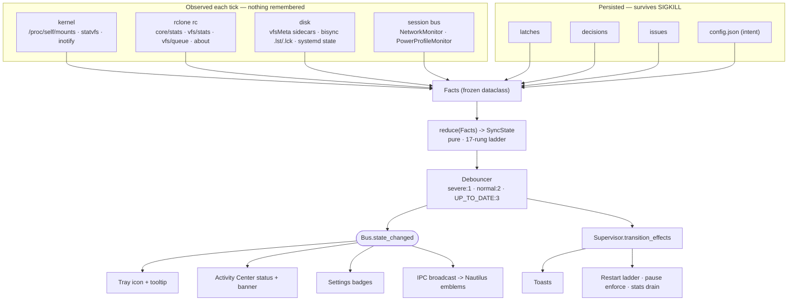
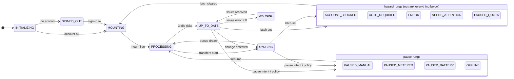

# OneDriveUI — Authoritative Build Specification

**Version:** 1.0 (synthesis of three independent architecture proposals)
**Date:** 2026-08-31
**Target:** CachyOS / Arch Linux, GNOME Shell 50.4 on Wayland, Python 3.14.7, PySide6 6.11.2 (Qt 6.11.2), rclone v1.75.0
**Status:** FROZEN for implementation. `docs/CONTRACTS.md` holds the frozen interfaces. `docs/BUILD_PLAN.md` holds the 14 disjoint work packages.

> Every claim in this document that is marked **[V]** was verified empirically on this machine by the
> research phase. Claims marked **[D]** are derived/designed and have no upstream source to check against.
> The eight research documents in `docs/research/` are the evidence base; this document is the decision record.

---

## Table of contents

1. [Product overview](#1-product-overview)
2. [Decision ledger — how the three proposals were adjudicated](#2-decision-ledger)
3. [Hard invariants (non-negotiable safety rules)](#3-hard-invariants)
4. [Feature parity matrix](#4-feature-parity-matrix)
5. [Process model and rclone engine strategy](#5-process-model-and-rclone-engine-strategy)
6. [The global sync state machine](#6-the-global-sync-state-machine)
7. [Threading model](#7-threading-model)
8. [Module manifest](#8-module-manifest)
9. [Config schema](#9-config-schema)
10. [SQLite schema](#10-sqlite-schema)
11. [Event bus signal catalogue](#11-event-bus-signal-catalogue)
12. [Error taxonomy and sync issues](#12-error-taxonomy-and-sync-issues)
13. [Directory layout on disk](#13-directory-layout-on-disk)
14. [Known parity gaps and non-goals](#14-known-parity-gaps-and-non-goals)

---

## 1. Product overview

OneDriveUI is a desktop OneDrive client for Linux that reproduces the **Microsoft OneDrive sync client for
Windows 11** — its features, its wording, and its Fluent look — on top of `rclone` as the sync engine.

The product is one GUI application (`onedriveui`) plus two supervised `rclone` services and one Nautilus
extension. It presents:

| Surface | Windows original | Our realisation |
|---|---|---|
| Tray icon | 10 distinct states, left- and right-click both open the Activity Center | StatusNotifierItem with 10 named icons + an 8-frame spinner; left-click opens a menu (GNOME AppIndicator forces this), whose first, default item opens the Activity Center |
| Activity Center | 360 px flyout anchored to the tray | 360 px **normal top-level window** — Wayland forbids self-positioning **[V]** |
| Settings | 1024×720, four-item NavigationView | Same, in a normal decorated `QMainWindow` |
| File Explorer overlays | Corner emblems + Status column + OneDrive submenu | nautilus-python 4.1 extension; emblems render *beside* the filename, not as corner overlays **[V]** |
| Files On-Demand | Cloud-file filter driver, three pin states | `rclone mount --vfs-cache-mode full` + our own pin table |
| Toasts | 23 catalogued notifications with action buttons | `org.freedesktop.Notifications` via **PyGObject Gio** (PySide6 QtDBus cannot marshal `uint32`) **[V]** |
| First-run wizard | 9 screens | Same screens, ~500×350 |

**The governing design principle** is that every visible surface is a **pure projection of one derived
state**. The tray icon, the tooltip, the Activity Center status line, the banner, the Settings badges and
the Nautilus emblems all read from a single `SyncState` produced by one pure reducer over one immutable
`Facts` snapshot. It is structurally impossible for the tray to say "synced" while the flyout says
"paused" — the two cannot disagree because they are the same value rendered twice.

**The governing safety principle** is that nothing authoritative lives in memory. User *intent* lives in
`config.json`; latched *hazards* and history live in SQLite; everything else is re-observed each tick from
the kernel (`/proc/self/mounts`, `statvfs`, inotify), from rclone's rc API, or from rclone's own on-disk
state (the VFS cache sidecars, the bisync workdir). A `SIGKILL` of the GUI therefore loses nothing: on
restart the app re-observes and lands in exactly the state it left, including "a bisync is running right
now" and "the mount is alive".

---

## 2. Decision ledger

Three proposals were produced independently. This section records what was taken from each and why. Where
they conflicted, the tie-breaker was always: **(a) empirically verified facts beat design elegance,
(b) data safety beats fidelity, (c) fidelity beats convenience.**

### D1 — The FUSE mount is owned by systemd, not by the GUI, and not by the rc daemon

- **P1 / P2 proposed:** the GUI spawns `rclone rcd` as a `QProcess` child and creates the mount through it
  with `mount/mount`. Argument: one VFS, one cache, one stats stream, and `mount/listmounts`/`mount/unmount`
  actually work (they are blind to CLI-started mounts **[V]**).
- **P3 proposed:** `rclone mount` runs as its own `systemd --user` unit (`Type=notify`, `Restart=on-failure`),
  separate from a control-plane `rcd`.
- **DECIDED: P3.** Reasoning:
  1. **An rcd crash must not unmount the user's filesystem.** If the mount lives inside rcd, every open file
     handle in every application breaks with `ENOTCONN` when rcd dies. P1 acknowledges this as "the central
     tradeoff of the single-engine thesis". It is not an acceptable one: a text editor with unsaved work in
     `~/OneDrive` must not be collateral damage of a GUI bug.
  2. **The `mount/listmounts` argument is void.** All three proposals independently concluded that the only
     correct liveness probe is `/proc/self/mounts` (fstype `fuse.rclone`) **AND** a non-raising `statvfs()`
     — because after a `SIGKILL` the `/proc` line survives and `os.path.ismount()` lies **[V]**. Since
     `mount/listmounts` is never used *in any proposal*, it cannot be a reason to prefer rc-mounting.
  3. **A failed `mount/mount` can permanently poison the fs for the daemon's lifetime** — a second VFS on
     the same fs becomes unaddressable as `onedrive:[0]`/`[1]`, and even a *failed* mount can register one
     **[V]**. Under P1/P2 the recovery is "restart the whole daemon", which also kills the control plane
     mid-OAuth. Under P3 the recovery is "restart the mount unit"; the control plane is untouched.
  4. **`Type=notify` gives free telemetry** — `systemctl --user show -p StatusText` returns a live
     `vfs cache: objects N ... to upload M` line **[V]**, usable as a fallback when rc is briefly unreachable.
  5. **The control plane must exist before any account does.** Sign-in is `config/create` + `config/oauthstatus`
     against an rc daemon; there is no remote to mount yet. A mount-hosted rc cannot serve the sign-in flow.
- **Windows parity is preserved, not sacrificed.** "Quit OneDrive" explicitly stops the mount unit
  (`systemctl --user stop onedriveui-mount@<acc>`), so quitting does stop syncing exactly as on Windows.
  The distinction P1 missed is that *quitting* is a deliberate user action while *crashing* is not; only the
  former should tear down the filesystem.

### D2 — rc transport is TCP loopback with generated credentials, not a unix socket

- **P1 proposed:** unix socket in a `0700` directory with `--rc-no-auth`. Cost: `QNetworkAccessManager`
  cannot speak `AF_UNIX`, so P1 needs **two dedicated rc threads** running its own `http.client`.
- **P2 / P3 proposed:** `127.0.0.1:<ephemeral>` with `--rc-user`/`--rc-pass`.
- **DECIDED: P2/P3.** `QNetworkAccessManager` was measured at **sub-10 ms round trips against a live
  `rclone rcd`, entirely on the GUI thread** **[V]**. That removes two threads and an entire class of
  cross-thread marshalling from the design. Security parity is real, not nominal: the generated password
  lives in `$XDG_RUNTIME_DIR/onedriveui/endpoints.json` mode `0600`, which is exactly as protected as a
  `0700` socket directory, and both are defeated only by an attacker who is already this user.
- Port selection is a bind-probe over **17800–17899**, never 5572 or 5573 (both already occupied on this
  machine by the user's own rclone processes **[V]**), recorded in `endpoints.json`.
- `--rc-no-auth` is never used: it exempts nothing in v1.75.0 anyway (all 101 commands report
  `NoAuth: false` **[V]**), so it buys nothing and costs the loopback threat model.

### D3 — bisync is always a subprocess, launched as a systemd transient unit

Unanimous across all three proposals that `sync/bisync` over the rc **behaves as `--max-delete 0` and cannot
be tuned by `_config` or daemon flags** **[V]**; only `force: true` bypasses it, which removes the safety net
entirely. Taking P3's refinement: launch via `systemd-run --user --collect --property=KillSignal=SIGINT
--property=TimeoutStopSec=150`, because that yields rclone's *graceful* shutdown rather than a `SIGKILL`
that leaves `<name>.<hash>.partial` files the next run resurrects as genuine new files **[V]**, and because
`systemctl --user is-active` is a crash-safe "is a run in progress?" oracle. `QProcess` is the fallback when
`systemd-run` is unavailable, behind the same `JobHandle` interface.

### D4 — Topology: mount-only by default; bisync is an opt-in "Offline folder"

Unanimous. Windows OneDrive has exactly one engine; so do we. `--vfs-cache-mode full` *is* Files On-Demand.
"Download all files" is implemented as bulk hydrate + pin-all + a raised cache budget, not as a topology
switch. The optional Offline folder uses a **disjoint remote sub-path excluded from the mount**, and every
run is gated on `vfs/stats.diskCache.uploadsQueued == 0`.

### D5 — State is derived, never stored (P3's thesis), expressed as a priority ladder (all three)

All three converged on a first-match-wins priority ladder rather than an edge-list FSM. P3's addition —
that the ladder's *inputs* are re-observed from disk and the kernel rather than remembered, and that
hazards are **latched into SQLite** — is what makes crash recovery exact. Adopted wholesale. The unified
ladder below is 17 rungs: P3's 16 plus P2's observation that active transfers outrank open errors (Windows
shows "Syncing N files" with a persistent issues banner beneath, not "Sync issues" alone).

### D6 — Version history and the recycle bin: a correction to all three proposals

All three proposed emulating version history via `--backup-dir` snapshots and the recycle bin via a hidden
remote `.onedriveui-trash/`. **All three are subtly wrong for the default mount-only topology, and this
document corrects them:**

- In **mount mode**, a file deleted through the FUSE mount is deleted server-side by rclone, and **Microsoft's
  own cloud recycle bin catches it**. The file is not lost; it is simply not browsable from rclone (rclone has
  no list/restore/empty API for the OneDrive bin at all **[V]**). Emulating a second, parallel trash for these
  deletions would consume the user's quota to duplicate something the server already does.
- Likewise, overwriting a file through the mount **does** create a server-side version (OneDrive Personal
  keeps the last 25); rclone can only *delete* versions, never list or restore them **[V]**.

Therefore the shipped behaviour is:

| Path | Where the safety net actually is | What the UI does |
|---|---|---|
| Delete via file manager / mount | Microsoft cloud recycle bin | "Recycle bin" deep-links to the web bin |
| Delete via **our** UI (context menu → Delete) | Our `onedrive:.onedriveui-trash/<ts>/` (server-side move, instant) | Browsable and restorable **in-app** |
| Overwrite via mount | Server-side version history (25 versions, personal) | "Version history" deep-links to the web |
| Overwrite during a **bisync** run | Our `--backup-dir` snapshot | Browsable and restorable **in-app** |

This is honest, costs no quota for the common case, and still gives working in-app undo for the actions the
user takes *through OneDriveUI*, which is the case they actually hit.

### D7 — Contracts frozen on day 0

All three proposals independently concluded that a set of shared files must be written and frozen before
parallel work begins. Adopted, with the union of the three lists: `models.py`, `bus.py`, `errors.py`,
`constants.py`, `strings.py`, `paths.py`, `data/schema.sql`, `ui/theme.py`, `ui/icons.py`. These are the only
files more than one work package reads. After WP-00 lands, **no package edits a file another package owns.**

### D8 — Smaller adjudications

| Question | P1 | P2 | P3 | Decided | Why |
|---|---|---|---|---|---|
| Nautilus IPC | unix socket NDJSON | D-Bus `com.github.OneDriveUI` | unix socket NDJSON | **unix socket NDJSON** | Fails fast (connect-refused) when the app is down instead of triggering D-Bus activation semantics; a 20 ms server budget is enforceable; push via a persistent `GLib.io_add_watch` channel |
| All D-Bus via | Gio | Gio | Gio | **Gio** | PySide6 6.11.2 `QDBusArgument` cannot marshal `uint32`, making `Notifications.Notify` uncallable from QtDBus **[V]** |
| Theme source | XDG portal | XDG portal | XDG portal | **XDG portal via Gio** | `QStyleHints.colorScheme()` is driven solely by a stale `~/.config/gtk-*/settings.ini` here and `colorSchemeChanged` never fires **[V]** |
| Settings format | JSON | JSON | JSON | **JSON** | `tomllib` is read-only; no TOML writer installed **[V]** |
| Bandwidth scope | global (honest) | per-account | per-account | **global, labelled as such** | `core/bwlimit` is process-global; `_config.BwLimit` is accepted and echoed but **does not throttle** **[V]**. Per-account would be a lie the code cannot honour. Applied to *both* daemons. |
| Name validation | Windows-style reject | Windows-style reject | Windows-style reject | **Windows-style reject**, `name_policy` configurable | rclone's `--onedrive-encoding` silently mangles illegal characters into fullwidth equivalents — surprising and hard to undo |
| DB writes | GUI thread | GUI thread | dedicated `DbWriter` thread | **`DbWriter` thread** | Keeps `fsync` off the GUI thread and serialises writes; latches must be durable before the UI claims they are |
| Window chrome | normal decorated | normal decorated | normal decorated | **normal decorated** | Frameless on Wayland loses compositor shadow, snapping and keyboard move/resize; `startSystemMove()` returns `False` outside a genuine input event **[V]** |

---

## 3. Hard invariants

These are enforced in code by `onedriveui/rc/guards.py`, which raises `SafetyRefusal`. A `SafetyRefusal` is a
**bug in the caller**, never a user-facing error to be clicked past. None of them is overridable by config.

| # | Invariant | Failure mode it prevents |
|---|---|---|
| **I1** | No `--onedrive-*` / `--drive-*` / connection-string backend option may appear on **any** rclone command line. All backend options go into `rclone.conf`. | A command-line backend override renames the fs to `onedrive{HASH}:` and **silently relocates the entire VFS cache**, turning every materialised file online-only. This machine already carries two orphaned trees, `~/.cache/rclone/vfs/onedrive/` and `.../onedrive{MxOuf}/` **[V]**. |
| **I2** | No rclone data-moving command (`sync`, `copy`, `move`, `bisync`, `delete`) may name a path at or under a `fuse.rclone` mountpoint. | `--vfs-write-back 5s` guarantees the "file changed during the run" timing that bisync explicitly warns causes data loss. |
| **I3** | Nothing whose VFS sidecar has `Dirty: true`, or whose name appears in `vfs/queue`, may be evicted, force-unmounted, or bisync'd around. | A dirty cache item is an un-uploaded local change that exists **nowhere else**. Deleting it is unrecoverable data loss. |
| **I4** | Cache paths are always read from `vfs/stats.diskCache.path` / `.pathMeta`. They are never derived by hand. | Hand-derivation misses the `{HASH}` suffix, a remote sub-path, and `--cache-dir`. |
| **I5** | Eviction unlinks the **meta sidecar first, then the data file**. | A crash between the two then leaves a data file with no metadata, which rclone correctly treats as uncached. The reverse leaves metadata claiming ranges that no longer exist. |
| **I6** | Mount liveness requires **both** a `/proc/self/mounts` line with fstype `fuse.rclone` **and** a `statvfs()` that does not raise. | After a `SIGKILL` the `/proc` line survives and every access returns `ENOTCONN` (errno 107); `os.path.ismount()` returns `True` for that dead mount **[V]**. |
| **I7** | Exactly one VFS per rclone process, and `mount/mount` is never called. | A duplicate VFS is permanently unaddressable (`vfs/list` reports `[0]`/`[1]` names every other `vfs/*` call rejects, and `fscache/clear` does not help) **[V]**. |
| **I8** | `operations/cleanup` is never called on a OneDrive remote, anywhere in the codebase. | On OneDrive, `cleanup` deletes **file versions**, not the trash, contradicting its own help text — and version deletion is unsupported on Personal **[V]**. |
| **I9** | `--onedrive-no-versions` and `--onedrive-hard-delete` are never set on a `drive_type=personal` remote. | Personal drives cannot delete versions and do not implement `permanentDelete`. |
| **I10** | Every local deletion the app itself performs goes to the freedesktop Trash, never `unlink()`. | Gives an undo for every destructive action we take. |
| **I11** | A rewrite of the bisync filters file is always paired with an immediate `--resync`, in one transaction. | Any change to the filters file is a **critical** bisync abort (exit 7, `.lst` → `.lst-err`) until a resync **[V]**. A crash between the two locks the account out of syncing. |
| **I12** | `--inplace` is never passed to any rclone command. | An interrupted in-place transfer corrupts the destination and the corruption propagates back on the next run. |
| **I13** | `- *.partial` is always present in the filters file, and bisync is stopped only with `SIGINT`. | A `SIGKILL` mid-transfer leaves `<name>.<hash>.partial` at the destination, which the next run syncs back as a genuine new file **[V]**. |
| **I14** | The rc password, the OAuth token, `config/dump` and `config/get` output never reach a log or a diagnostics bundle. | `config/dump` and `config/get` return the refresh token **in the clear** **[V]**. Use `rclone config redacted`. |
| **I15** | `--resync` is never run on a schedule; it requires an answered `decisions` row. | `--resync` only copies, never deletes: a scheduled resync resurrects deleted files forever and leaves renamed duplicates on both sides. |

---

## 4. Feature parity matrix

**Verdict key:** ● full parity · ◐ functional but visibly different · ◑ emulated (real storage, honest label)
· ○ web deep-link only · ✕ not shipped.

### 4.1 Tray icon and Activity Center

| Feature | Windows behaviour | Our mechanism | Module | |
|---|---|---|---|---|
| 10 tray states | synced / syncing / processing / paused / signed-out / error / warning / info / blocked / not-running | 10 named SVGs in `~/.local/share/icons/hicolor/scalable/status/`, set via `QIcon.fromTheme` (SNI cannot reliably take raw pixmaps) | `ui/tray.py`, `ui/icons.py` | ● |
| Sync animation | rotating arrows | 8 pre-rendered frames swapped by a 125 ms `QTimer` — SNI has no animation support **[V]** | `ui/tray.py` | ● |
| Personal vs work colour | white cloud / blue cloud | two icon families, chosen by `account.kind` | `ui/icons.py` | ● |
| Two accounts → two icons | yes | one `TrayItem` per account | `ui/tray.py` | ● |
| Left- and right-click both open Activity Center | since the 2019 redesign, identical | GNOME's AppIndicator maps left-click to opening the menu **[V]**; our menu's first, default item is "Open Activity Center" | `ui/tray.py` | ◐ |
| Activity Center flyout | 360 px, tray-anchored | 360 px **normal top-level `Qt.Tool` window**; `QSystemTrayIcon.geometry()` is a null rect, `QCursor.pos()` is `(0,0)`, and a `Qt.Popup` without a live input serial is dismissed by Mutter in <300 ms **[V]** | `ui/activity_center.py` | ◐ |
| Header always shows the account name, even in error states | explicit Microsoft change (MC333940) | header is rendered from `AccountInfo`, independent of `SyncState` | `ui/activity_center.py` | ● |
| Settings entry in the top-right corner | MC333940 | gear button at 16 px inset from the right | `ui/activity_center.py` | ● |
| Storage bar | "N GB of M GB used" | `operations/about` → `{total, used, trashed, free}`, 5-min TTL | `sync/quota.py`, `ui/widgets/indicators.py` | ● |
| Recent activity list | file rows with verb + time | three merged sources: `core/stats.transferring[]` (live), `core/transferred` (completed, incl. per-item `error`), local inotify events; persisted to SQLite because `core/transferred` holds only 100 entries and is wiped by `core/stats-reset` **[V]** | `sync/activity.py`, `ui/activity_model.py` | ● |
| Per-file progress in the feed | inline bar | `transferring[]` gives `name/size/bytes/percentage/speed/speedAvg/eta` | `ui/activity_model.py` | ● |
| "Recycle bin" footer command | MC333940 | web deep-link (see D6); **never** wired to `operations/cleanup` (I8) | `ui/activity_center.py` | ○ |
| Status strings verbatim | "Your files are synced", "Syncing N files", "Processing changes", "Sync is paused", "You're not signed in", "Sync issues", "Action needed", "Sign in required", "Your OneDrive is full" | one frozen `strings.STATUS_LINE[SyncState]` table; no widget contains a status literal | `strings.py` | ● |
| First-sync banner | "We're checking all your files to make sure they are up to date on this personal computer…" | shown while `INITIALIZING`/`PROCESSING` on the first run of an account | `ui/activity_center.py` | ● |

### 4.2 Files On-Demand

| Feature | Windows behaviour | Our mechanism | Module | |
|---|---|---|---|---|
| Online-only files | `attrib +u` (UNPINNED); placeholder, downloads on open | no VFS sidecar, or sidecar `Rs` is `null`/`[]` **[V]** | `rc/vfs.py` | ● |
| Locally available | neither P nor U; hydrated, evictable | sidecar `Rs == [{Pos:0, Size:Size}]` **[V]** | `rc/vfs.py` | ● |
| Always keep on this device | `attrib +p` (PINNED); never evicted | our own `pins` table + read-through-mount hydration; **rclone has no pin API and its LRU evictor does not know about pins**, so a `RepinWatcher` re-hydrates victims | `sync/pinner.py` | ◐ |
| Free up space | dehydrate | unlink meta then data (I5); `vfs/forget` returns `{"forgotten":[…]}` but provably leaves `bytesUsed` and the cache files untouched **[V]** | `sync/pinner.py`, `rc/vfs.py` | ● |
| "Free up disk space" / "Download all files" buttons | two buttons, each confirmed with "Continue" — *not* a toggle in current builds | two buttons, each confirmed with "Continue" | `ui/pages/page_sync.py` | ● |
| Storage Sense auto-dehydration | "free up space for files I haven't opened in N days" | `--vfs-cache-max-age`; note the rclone default is **1 h**, far too aggressive — we ship 720 h and let `--vfs-cache-max-size` do the work | `config.py` | ● |
| Hydration progress | shell progress | `SEEK_DATA`/`SEEK_HOLE` on the sparse cache file returns byte-identical ranges to `Rs` and is **synchronous**, whereas the sidecar lags ~10 s **[V]** | `sync/pinner.py` | ● |
| Cache size display | "OneDrive is using N GB on this PC" | `vfs/stats.diskCache.bytesUsed` | `ui/pages/page_sync.py` | ● |

### 4.3 Settings

| Feature | Windows behaviour | Our mechanism | Module | |
|---|---|---|---|---|
| Four-item nav | "Sync and back up", "Account", "Notifications", "About" | same four, verbatim | `ui/settings_window.py` | ● |
| Manage folder backup (KFM) | five folders: Desktop, Documents, Pictures, Music, Videos | XDG user-dirs rewrite + copy-verify-remove with a resumable journal | `sync/kfm.py` | ● |
| Desktop opt-out radio | "This computer only" → "Continue" | same; the other four confirm with "OK" | `ui/dialogs/sync_dialogs.py` | ● |
| "Where are my files" shortcut | left in the original folder | `.desktop` link pointing into the sync root | `sync/kfm.py` | ● |
| Choose folders | tri-state tree with per-folder sizes | lazy `operations/list dirsOnly` + async `operations/size`; writes the filters file, then prunes locally **after** success | `sync/selective.py` | ● |
| Excluded file extensions | chips + "Exclude" | filter rules | `sync/selective.py` | ● |
| Bandwidth | "Limit download rate" / "Limit upload rate", 50–100 000 **KB/s**, plus "Adjust automatically" | `core/bwlimit` (the only throttle that works **[V]**); KB/s→KiB/s converted in exactly one function | `sync/bandwidth.py`, `units.py` | ● |
| "Adjust automatically" | Microsoft pins it to 70 % of measured throughput | a controller that samples achieved throughput every 30 s, sets 70 %, and lifts the limit for 60 s each period | `sync/bandwidth.py` | ◑ |
| Pause on metered | toggle (shipped Windows string contains "is in on a metered network" — sic) | `Gio.NetworkMonitor` / NetworkManager `Metered ∈ {1,3}` **[V]** | `platform/power.py`, `sync/pause.py` | ● |
| Pause on battery saver | toggle | `Gio.PowerProfileMonitor` / `PowerProfiles.ActiveProfile == 'power-saver'` **[V]** | `platform/power.py` | ● |
| File collaboration / conflict policy | "Let me choose to merge changes or keep both copies" (default) · "Always keep both copies (rename the copy on this computer)" | both options; merge is replaced by "keep both" since there is no Office integration | `sync/conflicts.py` | ◐ |
| Start OneDrive when I sign in | toggle | a `systemd --user` unit **or** an XDG autostart entry — **never both**, or the app launches twice **[V]** | `platform/autostart.py` | ● |
| Notifications tab, 5 toggles, all default ON | verbatim strings | five config keys gating `Notifier` categories | `ui/pages/page_notifications.py` | ● |
| Unlink this PC | with reassurance text; local files kept | `config/delete` + unit teardown; **never** touches the local folder | `sync/accounts.py` | ● |
| Account identity (name, email) | from the sign-in | rclone's `Features.UserInfo` is **false** for OneDrive and `config userinfo` errors **[V]** — captured during OAuth, or read from a user-owned file's `created-by-display-name` metadata | `sync/accounts.py` | ◐ |

### 4.4 Sync behaviour, errors and safety

| Feature | Windows behaviour | Our mechanism | Module | |
|---|---|---|---|---|
| Pause 2 h / 8 h / 24 h | menu, auto-resume | persisted `paused_until` + a re-armed `QTimer`; a restart honours it | `sync/pause.py` | ● |
| Pause actually stops uploads | filter driver holds them | the mount's write-back queue uploads regardless of job control, so pause = repeatedly push every `vfs/queue` item's expiry past the deadline (re-issued each tick) + block new pin jobs + stop scheduled bisync. **Files already uploading finish** — stated in the UI, not hidden. | `sync/pause.py` | ◐ |
| Pause does not unmount | reads of local files keep working | we never unmount on pause | `sync/pause.py` | ● |
| Conflict naming | `MyFile.docx` → `MyFile-LaptopName.docx` | `-{hostname -s}` suffix, byte-identical | `sync/conflicts.py` | ● |
| Mass-delete confirmation | ≥200 items → "Delete these N items?" with Delete them / Restore files / Always remove files; 7 days to answer or nothing is deleted | a `decisions` row that survives a crash and expires after 7 days meaning **do not delete**; also raised by bisync's `--max-delete` abort | `sync/decisions.py` | ● |
| First-delete education | "Deleted files are removed everywhere" + "Don't show this reminder again" | `dialog_seen` key | `ui/dialogs/common_dialogs.py` | ● |
| Sync issues list | per-file rows with fix actions | `issues` table fed by `core/transferred[].error`, `core/stats.lastError`, bisync log records, preflight, and health facts | `sync/issues.py` | ● |
| Invalid-name error | "names contain characters that prevent syncing" + rename prompt | pre-flight validation *before* the transfer, reproducing Windows rather than rclone's silent fullwidth encoding | `sync/preflight.py` | ● |
| Quota full | "Your OneDrive is full" | `operations/about` + HTTP 507 (a `FatalError`, never retried **[V]**) | `sync/quota.py` | ● |
| Throttling | invisible; shows as long "Processing changes" | rclone honours `Retry-After` exactly **[V]**; we cap `--tpslimit 8 --tpslimit-burst 10`, `--transfers 4`, `--checkers 8` under Microsoft's 3 000-req/5-min per-user limit | `rc/mountd.py` | ● |
| Version history | dialog with Restore / View online / Delete version | server-side versions exist but rclone can only *delete* them **[V]** → web deep-link; **plus** in-app restore of our own bisync `--backup-dir` snapshots (see D6) | `sync/versions.py` | ◑/○ |
| Cloud recycle bin | browse and restore | no rclone API at all **[V]** → web deep-link; **plus** in-app restore of items deleted *through our UI* into `.onedriveui-trash/` (see D6) | `sync/trashbin.py` | ◑/○ |
| "Restore your OneDrive" (point-in-time, 30 days, activity chart, date slider) | full dialog | no rclone and no lightweight Graph path | — | ○ |

### 4.5 Sharing

| Feature | Windows behaviour | Our mechanism | Module | |
|---|---|---|---|---|
| Copy link | 1drv.ms page URL | `operations/publiclink`; note rclone returns a **direct-download** URL for files, not the pretty page URL **[V]** — shown as a caveat in the dialog | `sync/sharing.py` | ◐ |
| Anyone / Specific people | link scope | `--onedrive-link-scope anonymous\|organization\|users` (via `rclone.conf`, per I1) | `sync/sharing.py` | ● |
| Can edit / Can view | link type | `--onedrive-link-type view\|edit\|embed` | `sync/sharing.py` | ● |
| Expiry / password | Premium-gated server-side | `rclone link --expire`, `--onedrive-link-password`; same server-side gating as Windows | `sync/sharing.py` | ● |
| **Remove link / stop sharing** | revokes | `--unlink` is a **verified silent no-op on OneDrive that CREATES a link** — grepping all of `onedrive.go` for `unlink` yields exactly one hit, the unused parameter declaration **[V]**. The control ships **disabled with an inline explanation** and a web hand-off. Presenting it as working would tell users a live link is dead. | `sync/sharing.py` | ✕ → ○ |
| Manage access (list people) | list | `--onedrive-metadata-permissions read,write` + `--metadata-mapper`; 5 resource units per permission op | `sync/sharing.py` | ◐ |
| Send link by email | in-client | Graph `invite` is not exposed by rclone → `mailto:` with the copied link | `sync/sharing.py` | ◐ |

### 4.6 Desktop integration

| Feature | Windows behaviour | Our mechanism | Module | |
|---|---|---|---|---|
| Explorer status overlays | corner emblems on the icon | Nautilus 4.1 `InfoProvider.add_emblem`; **emblems render beside the filename (list view) or down the tile's right edge (grid view)**, never as corner overlays **[V]** | `ext/nautilus_onedriveui.py` | ◐ |
| Status column | "Status" column | `ColumnProvider` + `add_string_attribute`; the user must enable it manually — there is no API to force it on **[V]** | `ext/nautilus_onedriveui.py` | ◐ |
| OneDrive context submenu | Share / View online / Version history / Always keep / Free up space | `MenuProvider.get_file_items` (guard: called with an **empty** list for the background menu **[V]**) | `ext/nautilus_onedriveui.py` | ● |
| In-window banner | yellow bar | `Nautilus.LocationWidgetProvider` **does not exist in Nautilus 4.x** **[V]** | — | ✕ |
| Sidebar entry | "OneDrive - Personal" | `~/.config/gtk-3.0/bookmarks` and `gtk-4.0/bookmarks` | `platform/desktop.py` | ● |
| Show in folder | selects the file | `org.freedesktop.FileManager1.ShowItems` (D-Bus-activated) **[V]** | `platform/desktop.py` | ● |
| Toasts with action buttons | 23 catalogued | `Gio.DBusConnection` + `GLib.Variant("(susssasa{sv}i)")`; `urgency` must be GVariant **BYTE `y`**, not `i` **[V]**; GNOME renders ~3 buttons so we cap at 2 | `platform/notify.py` | ● |
| Background Apps entry | — | `portal.Background.SetStatus` is hard-gated to sandboxed apps **[V]** | — | ✕ |
| Dolphin/KDE overlays | — | out of scope for v1 (would need a C++ `KOverlayIconPlugin`); the in-app file browser covers non-Nautilus desktops | `ui/filebrowser.py` | ✕ |

### 4.7 Personal Vault

| Feature | Windows behaviour | Our mechanism | Module | |
|---|---|---|---|---|
| Lock / unlock UX | passphrase, auto-lock | gocryptfs container + libsecret, mounted at `<root>/Personal Vault` | `sync/vault.py` | ◑ |
| Auto-lock 20 m / 1 h / 2 h / 4 h | dropdown | same four values | `sync/vault.py` | ● |
| 5-minute warning toast | "Still Using Your Personal Vault" + "Lock Personal Vault" action | same, with the action button | `platform/notify.py` | ● |
| "Quit" hides inside "Pause syncing" while locked | UI quirk | reproduced | `ui/tray.py` | ● |
| **Cloud vault** | server-side protected | OneDrive **blocks API access to a locked vault**, and it lives on a **different drive ID** (`b!…` prefix) **[V]**. Ours is local-device encryption and the UI says so, rather than implying parity. | `sync/vault.py` | ✕ → ◑ |

### 4.8 Where we exceed Windows

| | |
|---|---|
| **Account count** | Windows allows exactly one personal account plus nine work/school. One rclone remote per account means we have no such limit. |
| **Crash recovery** | The Windows client's state is opaque; ours is re-derived from the kernel and disk, so a `SIGKILL` costs nothing. |
| **In-app file browser** | Windows relies wholly on Explorer. We ship a browser with a real Status column so non-Nautilus desktops are not second-class. |

---

## 5. Process model and rclone engine strategy

### 5.1 Topology

```
┌──────────────────────────────────────────────────────────────────────────────┐
│ onedriveui  (GUI, PySide6, one process, one per login session)               │
│  • tray, all windows, SQLite, notifications, IPC server, supervisor          │
│  • owns nothing that must survive it                                         │
└───┬──────────────────────┬──────────────────────┬───────────────────────┬────┘
    │ HTTP/JSON (QNAM)     │ HTTP/JSON (QNAM)     │ systemd1 D-Bus        │ NDJSON
    │ 127.0.0.1:<pC>       │ 127.0.0.1:<pM>       │ start/stop/restart    │ unix sock
    ▼                      ▼                      ▼                       ▼
┌────────────────┐  ┌───────────────────┐  ┌──────────────────┐  ┌──────────────┐
│ onedriveui-rcd │  │ onedriveui-mount@ │  │ onedriveui-bisync│  │ Nautilus     │
│  .service      │  │  <account>.service│  │  -<acc> (transient│ │  extension   │
│ CONTROL PLANE  │  │  DATA PLANE       │  │  , opt-in)       │  │ (system py)  │
│ rclone rcd     │  │ rclone mount --rc │  │ rclone bisync    │  │ stdlib + gi  │
│ Restart=always │  │ Type=notify       │  │ KillSignal=SIGINT│  │              │
│ no VFS         │  │ Restart=on-failure│  │ one-shot         │  │              │
└────────────────┘  └───────────────────┘  └──────────────────┘  └──────────────┘
```

### 5.2 Tier 1 — `onedriveui-rcd.service` (control plane)

Account-independent, always up, starts before any account exists.

```
[Unit]
Description=OneDriveUI rclone control plane
PartOf=graphical-session.target
After=graphical-session-pre.target

[Service]
Type=simple
ExecStart=/usr/bin/rclone rcd \
  --rc-addr 127.0.0.1:${PORT} \
  --rc-user onedriveui --rc-pass ${PASS} \
  --rc-job-expire-duration 10m --rc-job-expire-interval 30s \
  --rc-server-write-timeout 1h \
  --user-agent "ISV|OneDriveUI|OneDriveUI/${VER}" \
  --use-json-log --color NEVER --log-level INFO --stats 0
Restart=always
RestartSec=5

[Install]
WantedBy=default.target
```

Serves: `config/*` (the whole OAuth flow), `operations/{about,list,stat,publiclink,mkdir,purge,rmdir,deletefile,movefile,copyfile,uploadfile,check,size,fsinfo}`, `core/version`, `core/bwlimit`, `job/*`, `options/*`.

`--rc-job-expire-duration 10m` — **not** the 60 s default, which garbage-collects a finished job's `output`
before a restarted GUI can read it **[V]**.

**`network-online.target` is deliberately absent.** It does not exist in the systemd `--user` manager
(`LoadState=not-found`) and `After=`/`Wants=` on it are silently ignored **[V]**; emitting it would mislead
maintainers. rclone's own retry logic covers boot-time network races.

### 5.3 Tier 2 — `onedriveui-mount@<account>.service` (data plane)

```
[Unit]
Description=OneDriveUI mount for %i
After=graphical-session-pre.target

[Service]
Type=notify
ExecStart=/usr/bin/rclone mount onedrive: %h/OneDrive \
  --vfs-cache-mode full \
  --cache-dir %h/.cache/rclone \
  --vfs-cache-max-size 50G --vfs-cache-max-age 720h --vfs-cache-min-free-space 5G \
  --vfs-cache-poll-interval 1m --vfs-write-back 5s --vfs-fast-fingerprint \
  --dir-cache-time 1h --poll-interval 60s --attr-timeout 1s \
  --vfs-read-chunk-size 32M --vfs-read-chunk-size-limit 512M \
  --transfers 4 --checkers 8 --tpslimit 8 --tpslimit-burst 10 \
  --retries 3 --low-level-retries 10 \
  --file-perms 0644 --dir-perms 0755 --umask 022 --devname OneDrive \
  --exclude "/.onedriveui-trash/**" --exclude "/.onedriveui-versions/**" --exclude "/.Trash-1000/**" \
  --rc --rc-addr 127.0.0.1:${PORT2} --rc-user onedriveui --rc-pass ${PASS} \
  --user-agent "ISV|OneDriveUI|OneDriveUI/${VER}" \
  --use-json-log --color NEVER --log-level INFO
ExecStop=/usr/bin/fusermount3 -uz %h/OneDrive
Restart=on-failure
RestartSec=10
TimeoutStopSec=120
KillMode=mixed

[Install]
WantedBy=default.target
```

Serves: `vfs/{stats,queue,queue-set-expiry,refresh,forget,poll-interval}`, `core/stats`, `core/transferred`,
`core/bwlimit` (for actual data transfer — this is the process that moves bytes).

Notes bound into the argv above:
- **No `--daemon`.** It is broken with `--rc --rc-addr` in v1.75.0: the parent binds the port *before*
  forking and the child dies with `bind: address already in use` **[V]**.
- **No `--allow-other`.** It fails unless root adds `user_allow_other` to `/etc/fuse.conf`; the option is
  commented out on this machine **[V]**.
- **No `--vfs-read-chunk-streams`.** Parallel streams cause Graph 429s.
- **`--poll-interval` (60 s) must be strictly smaller than `--dir-cache-time` (1 h)** or polling is useless.
- **No `--onedrive-*` flags** (I1). `chunk_size`, `delta`, `link_scope`, `link_type`, `hash_type`,
  `metadata_permissions` all live in `rclone.conf`.
- `--vfs-cache-max-age 720h`, not rclone's 1 h default, which would evict files the user just made offline.

### 5.4 Tier 3 — bisync (opt-in "Offline folder")

```
systemd-run --user --collect --unit=onedriveui-bisync-<acc> \
  --property=KillSignal=SIGINT --property=TimeoutStopSec=150 --property=Restart=no \
  -- /usr/bin/rclone bisync ~/OneDrive-Offline onedrive:Offline \
     --workdir ~/.local/state/onedriveui/bisync/<acc> \
     --filters-file ~/.config/onedriveui/filters-<acc>.txt \
     --conflict-resolve newer --conflict-loser pathname --conflict-suffix "-$(hostname -s)" \
     --max-delete 25 --check-access --check-filename RCLONE_TEST \
     --max-lock 2m --resilient --recover --create-empty-src-dirs --track-renames \
     --backup-dir1 ... --backup-dir2 onedrive:.onedriveui-versions/<ts> \
     --suffix "-<ISO8601>" --suffix-keep-extension \
     --transfers 4 --checkers 8 \
     --use-json-log --color NEVER --stats 500ms --stats-log-level NOTICE \
     --log-file <run_dir>/bisync.jsonl
```

- `--workdir` is under `~/.local/state`, **never** `~/.cache/rclone/bisync`, which rclone's own cache
  cleaning may destroy.
- `--color NEVER` is mandatory: `--use-json-log` alone still embeds raw ANSI escapes in the `msg` field **[V]**.
- The log goes to a **file we tail**, never a pipe, so a GUI restart re-attaches from the byte offset
  checkpointed in the `runs` row.
- Exit code 130 (SIGINT) is **ambiguous** — a graceful shutdown can end in either `Bisync successful` or
  `Bisync aborted. Must run --resync to recover.` **[V]** The verdict is always read from the log, never
  from the exit code alone.

### 5.5 Ownership proof (mandatory before any rc call)

An `rcd` daemon is equivalent to shell access as this user. A foreign rclone is already listening on
127.0.0.1:5572 on this machine **[V]**. Therefore, before OneDriveUI drives *any* endpoint:

```python
pid = rc("core/pid")["pid"]
cmdline = Path(f"/proc/{pid}/cmdline").read_bytes().decode().split("\0")
joined = " ".join(cmdline)
ours = (f"--rc-addr" in cmdline
        and f"127.0.0.1:{ep.port}" in joined
        and (("rcd" in cmdline) if ep.kind == "rcd" else (str(ep.mountpoint) in joined)))
if not ours:
    raise DaemonForeign(ep)                      # never drive it, never core/quit it
starttime = int(Path(f"/proc/{pid}/stat").read_text().rsplit(") ", 1)[1].split()[19])
execute_id = rc("job/list")["executeId"]         # a per-process UUID
```

- `starttime` (`/proc/<pid>/stat` field 22) defends against PID reuse.
- **A change in `executeId` is the definition of "the daemon restarted"**: all job ids, mounts, VFSes and
  transfer history are gone; drop every in-flight job handle and re-observe. It is also the only way to
  disambiguate `job/status → HTTP 500 "job not found"` between *expired* (same `executeId`) and
  *daemon restarted* (different `executeId`) **[V]**.
- A stale socket or an open port is **never** proof of a live daemon: `core/quit` does not unlink a unix
  socket, and any `rclone` command started with `--rc` exposes all 101 endpoints **[V]**. Always probe
  `rc/noop` with a short timeout first.

### 5.6 What does *not* go through the rc, and why

| Need | Why the rc cannot do it | Mechanism | Module |
|---|---|---|---|
| Hydrate a file ("Always keep on this device") | no pin or prefetch endpoint exists in the 101-command API | read the file end-to-end through the mount, 4 MiB blocks, `buffering=0`, ≤3 concurrent | `sync/pinner.py` |
| Evict a file ("Free up space") | `vfs/forget` provably leaves `bytesUsed` and the cache files untouched **[V]**; `options/set{vfs:…}` does not affect a live VFS **[V]** | unlink meta then data (I5) | `rc/vfs.py` |
| Per-file FOD state | the rc exposes only `vfs/stats` aggregates | parse `vfsMeta/**` sidecar JSON | `rc/vfs.py` |
| Two-way sync | `sync/bisync` over the rc is `--max-delete 0` and untunable **[V]** | `systemd-run` subprocess | `rc/bisync.py` |
| Stale-mount teardown | FUSE-level | `fusermount3 -uz` | `rc/mountd.py` |
| Service lifecycle | — | `org.freedesktop.systemd1` D-Bus | `platform/systemd.py` |

Everything else — auth, quota, listing, sharing, bandwidth, filters, copy/move/delete, job control, stats —
is a pure rc call. There are **zero per-action `rclone` CLI invocations** in the hot path.

### 5.7 Crash recovery

| Event | Detection | Response |
|---|---|---|
| rcd died | `systemd` `ActiveState != active`, or 3 consecutive rc failures | systemd restarts it; we re-probe ownership, compare `executeId`, invalidate job handles, re-apply `core/bwlimit` |
| Mount died | I6 probe fails | `fusermount3 -uz` then `systemctl --user restart onedriveui-mount@<acc>`, on the ladder **10 s / 30 s / 2 m / 10 m**, max **3 per hour**. **Refuses to restart while `uploadsInProgress > 0`** unless the mount is already stale (I3). |
| GUI died | n/a | mount and rcd keep running; on relaunch, `Facts` re-observes everything, the bisync tailer resumes from `runs.log_offset`, and `latches` restore every hazard |
| Job expired | `job/status` 500 + unchanged `executeId` | "outcome unknown"; the activity row is marked `interrupted`, not `error` |
| Daemon restarted | `executeId` changed | all in-flight rows → `interrupted`; re-mount, re-apply bwlimit and poll-interval |
| bisync run orphaned | `systemctl --user is-active onedriveui-bisync-<acc>` | adopt: re-attach the log tailer at `runs.log_offset` |

After **5 consecutive rcd failures within 5 minutes**, stop retrying, enter `ERROR`, and offer
"Report a problem" with the last 200 redacted stderr lines.

---

## 6. The global sync state machine

### 6.1 Shape

`reduce(facts: Facts) -> SyncState` is a **pure function**: no I/O, no Qt, no globals, no clock. It is a
first-match-wins priority ladder, not a transition graph. Events never assign a state; they mutate
`Facts` (re-observed) or a small set of **latches** (persisted), and the ladder is re-evaluated.

This is what makes tray/tooltip/status-line/banner disagreement structurally impossible, and it makes the
whole state layer unit-testable with hand-built `Facts` and zero fixtures.

### 6.2 Inputs — one immutable `Facts` per tick

Cadence: **400 ms** while transferring, **2000 ms** idle, **10 s** while paused. Each source is individually
`try`/`except`ed: a dead subsystem degrades to `UNKNOWN` and is flagged in `facts.stale`, never crashing
the tick.

| Field | Type | Source | Cadence |
|---|---|---|---|
| `daemon_rcd` | `DaemonHealth` | systemd `ActiveState` + `rc/noop` + ownership proof | 2 s |
| `daemon_mount` | `DaemonHealth` | same, against the mount's rc | 2 s |
| `mount` | `MountHealth` | `/proc/self/mounts` + `statvfs` (I6) | 2 s |
| `execute_id` | `str \| None` | `job/list.executeId` | 5 s |
| `account_configured` | `bool` | `config/listremotes` | event |
| `token` | `TokenHealth` | `operations/about` result classified by `errors.AUTH_PATTERNS` | 5 min, and on any error |
| `quota` | `QuotaInfo` | `operations/about` | 5 min |
| `network` | `NetworkState` | `Gio.NetworkMonitor` | signal |
| `power` | `PowerState` | `Gio.PowerProfileMonitor` | signal |
| `transfers_active` / `checks_active` | `int` | `core/stats` (mount daemon) | tick |
| `uploads_queued` / `uploads_in_progress` / `errored_files` / `out_of_space` | `int`/`bool` | `vfs/stats.diskCache` | 1–10 s |
| `pin_jobs_active` | `int` | `sync/pinner` | event |
| `scan_in_progress` | `bool` | `sync/facts` (warm-up / cache scan) | event |
| `bisync` | `BisyncState` | `systemctl is-active` + workdir `.lst`/`.lst-err`/`.lck` inspection | 5 s |
| `issues` | `(blocking, error, warning)` | `issues` table | event |
| `pending_decisions` | `int` | `decisions` table | event |
| `pause_intent` / `pause_until` | `PauseReason`/`datetime` | `latches` + config | event |
| `policy_pause` | `PauseReason` | `power` + `network` + config | derived |
| `latches` | `dict[str,str]` | `latches` table | event |
| `startup_elapsed_s` | `float` | monotonic clock at app start | tick |

### 6.3 The ladder — 17 rungs, first match wins

| # | Condition | State | Tray icon | Status line |
|---|---|---|---|---|
| 1 | `not account_configured` | `SIGNED_OUT` | `signedout` (grey cloud, diagonal line) | "You're not signed in" |
| 2 | `startup_elapsed_s < 8 and daemon_rcd in (DOWN, STARTING)` | `INITIALIZING` | `info` | "Starting OneDrive…" |
| 3 | `token == TENANT_BLOCKED` | `ACCOUNT_BLOCKED` | `blocked` (red no-entry) | "Your account is blocked" |
| 4 | `token in (EXPIRED, MFA)` | `AUTH_REQUIRED` | `blocked` | "Sign in required" |
| 5 | `daemon_rcd in (DOWN, FOREIGN)` **or** `mount == STALE` **or** `bisync in (CRITICAL, LOCK_STUCK)` **or** `issues.blocking > 0` | `ERROR` | `error` (red circle + white cross) | "Action needed" |
| 6 | `pending_decisions > 0` **or** `bisync == NEEDS_RESYNC` | `NEEDS_ATTENTION` | `info` (blue circle with *i*) | "Action needed" |
| 7 | `quota.is_full or out_of_space or latches.quota_exceeded` | `PAUSED_QUOTA` | `warning` (yellow triangle) | "Your OneDrive is full" |
| 8 | `pause_intent == MANUAL and (pause_until is None or now < pause_until)` | `PAUSED_MANUAL` | `paused` | "Sync is paused" |
| 9 | `policy_pause == METERED` | `PAUSED_METERED` | `paused` | "Sync is paused" + metered banner |
| 10 | `policy_pause == BATTERY` | `PAUSED_BATTERY` | `paused` | "Sync is paused" + battery banner |
| 11 | `network == OFFLINE or consecutive_net_failures >= 3` | `OFFLINE` | `info` | "OneDrive isn't connected" |
| 12 | `mount_enabled and mount in (DOWN, STARTING)` | `MOUNTING` | `syncing` (spinner) | "Processing changes" |
| 13 | `transfers_active or uploads_in_progress or pin_jobs_active` | `SYNCING` | `syncing` (spinner) | "Syncing {n} files" |
| 14 | `scan_in_progress or checks_active or bisync == RUNNING or uploads_queued` | `PROCESSING` | `syncing` (spinner) | "Processing changes" |
| 15 | `issues.error > 0` | `WARNING` | `warning` | "Sync issues" |
| 16 | `info_notice is not None` | `INFO_NOTICE` | `info` | "Your files are synced" (+ notice banner) |
| 17 | *otherwise* | `UP_TO_DATE` | `synced` (plain cloud) | "Your files are synced" |

`NOT_RUNNING` is not reachable from the reducer — it is what the *absence* of a tray icon means.

**Rungs 13–15 matter.** While transfers are in flight *with* unresolved errors the state is `SYNCING` and the
error banner renders *below* the status line — exactly what Windows shows ("Syncing N files" plus a
persistent "Sync issues" banner). `WARNING` only becomes the headline once transfer quiesces.

### 6.4 Hysteresis

| Rule | Value | Reason |
|---|---|---|
| Severe states (`ERROR`, `AUTH_REQUIRED`, `ACCOUNT_BLOCKED`, `PAUSED_QUOTA`, `NEEDS_ATTENTION`) | apply on the **first** tick | a hazard must never be delayed |
| All other states | **2 consecutive** ticks | a single ECONNRESET during a token refresh must not blank the UI |
| `UP_TO_DATE` | **3 consecutive** ticks with a zero queue | otherwise a multi-file batch flickers between states between transfers |
| `OFFLINE` | 3 consecutive network failures | |
| `MOUNTING` | suppressed for 15 s after a deliberate restart | a restart must not read as an error |
| `PROCESSING` | 250 ms entry delay | a 200 ms directory listing must not flash the banner |

`StateMachine` emits `state_changed` only when `(state, substate_text, round(progress_pct))` differs, which
debounces a 2.5 Hz poll into ≤2 UI updates per second and stops the SNI icon thrashing.

### 6.5 Latches — hazards that survive a crash

Persisted in the `latches` table, cleared only by an explicit action or a contradicting observation.

| Latch | Set by | Cleared by | Feeds |
|---|---|---|---|
| `needs_resync` | bisync verdict `NEEDS_RESYNC`, or `.lst-err` present | a successful `--resync` | rung 6 |
| `bisync_critical` | verdict `CRITICAL_*` | a successful run | rung 5 |
| `quota_exceeded` | `about` shows no free space, or HTTP 507 | `about` reports free space again | rung 7 |
| `mount_failed` | restart-ladder counter (hourly window) | a healthy mount for 60 s | rung 5 |
| `orphan_cache` | a sibling `onedrive*/` cache tree found | the reclaim action | an info notice |

### 6.6 Transition effects (declarative; executed by `Supervisor`)

| Transition | Effect |
|---|---|
| `* → PAUSED_METERED` / `PAUSED_BATTERY` | toast with a **"Sync Anyway"** action (gated by `notifications.paused`); `PauseManager.enforce()` begins deferring the VFS queue each tick |
| `* → PAUSED_QUOTA` | toast "Your OneDrive is full"; persistent InfoBar with "Get more storage" / "Free up space"; uploads deferred, **downloads left alone** |
| `* → AUTH_REQUIRED` | toast "Sign in required"; jobs suspended; **the mount is not unmounted** so cached reads keep working |
| `* → ERROR` with `mount == STALE` | `fusermount3 -uz` + restart ladder (§5.7) |
| `* → NEEDS_ATTENTION` | raise the decision dialog once; toast carrying the decision's primary action |
| `SYNCING → UP_TO_DATE` | drain `core/transferred` into `activity` **first**, *then* `core/stats-reset` for that group — the reset also wipes `core/transferred` **[V]** |
| *any* | `Bus.state_changed` → tray icon, tooltip, status line, banner, and the Nautilus IPC invalidation broadcast, all from one map |

### 6.7 Diagram





---

## 7. Threading model

**One rule:** no thread but the GUI thread touches a `QWidget`; every cross-thread hand-off is a `Signal`
with `Qt.QueuedConnection`. There are no `QMutex`es in application code.

### 7.1 GUI / main thread

Everything Qt and everything I/O-cheap:

- **All rc calls** via `QNetworkAccessManager.post()` — measured sub-10 ms against a live `rcd` **[V]**.
  `requests`/`urllib` are **banned** on this thread (synchronous → frozen UI). Every reply is
  `deleteLater()`d. A 4 s timeout aborts and counts toward `consecutive_net_failures`.
- **All `QProcess`** (bisync fallback, `fusermount3`, `rclone authorize`) with `SeparateChannels`. rclone
  writes stats and logs to **stderr** and `lsjson` data to **stdout** — both channels must be drained, and
  `readyReadStandardOutput` delivers arbitrary byte chunks, not lines **[V]**, so both are line-buffered.
- **The GLib pump**: `QTimer(50 ms) → GLib.MainContext.default().iteration(False)`. This is **mandatory and
  load-bearing**. PySide6 6.11.2's `QDBusArgument` cannot marshal a `uint32`, so
  `org.freedesktop.Notifications.Notify` (signature `susssasa{sv}i`) is uncallable from QtDBus **[V]**.
  Once GLib is pumped, `Gio.NetworkMonitor`, `Gio.PowerProfileMonitor`, `Gio.FileMonitor`, the XDG portal
  theme watcher and `org.freedesktop.systemd1` all come free with **no extra threads**. If this pump stalls,
  notifications, metered detection and theme changes stop *silently* — treat it as a critical path.
- **inotify on `vfsMeta/`** via a raw fd wrapped in `QSocketNotifier` (never blocks) to detect eviction
  (`IN_DELETE`) and re-pin. `Gio.FileMonitor` handles the sync root (inotify is verified working on the
  rclone FUSE mount for **local** changes **[V]**; remote changes arrive only via `--poll-interval`).
- **Timers**: fact tick (400/2000/10000 ms), tray spinner 125 ms, pause auto-resume, vault auto-lock
  (+ the T−5 min warning), GLib pump 50 ms, quota 5 min, prune hourly.

### 7.2 `DbWriter` — exactly one long-lived `QThread`

Owns the **single** read-write SQLite connection (WAL, `synchronous=NORMAL`, `busy_timeout=5000`).
Mutations are submitted as callables and flushed in batched transactions on a 100 ms timer, or immediately
with `urgent=True` — used for `latches` and `decisions`, which must be durable before the UI claims they are.

The GUI thread reads through **per-thread read-only connections** (`file:…?mode=ro`) for small indexed
queries only, budgeted under 5 ms; WAL makes those safe against the concurrent writer.

Consequence: the GUI never blocks on `fsync`, and a crash mid-batch can lose at most the last ≤100 ms of
*observability* data — never a latch or an answered decision.

### 7.3 `IOPool` — one `QThreadPool`, `maxThreadCount = 4`

Blocking filesystem and through-FUSE work only. Every task carries a shared cancellation token and reports
progress by `Signal`. **No task in the pool opens a SQLite write connection** — it emits records that
`DbWriter` persists.

| Task | Concurrency | Notes |
|---|---|---|
| `HydrateTask` | **≤3** | 4 MiB sequential reads, `buffering=0`; never `sendfile`/`copy_file_range` through FUSE; ≤ `--transfers` |
| `CacheScanTask` | 1 | walks `vfsMeta/**`, thousands of small JSON reads; full scan on start and every 6 h, incremental on inotify |
| `EvictTask` | 1 | unlink storms; meta-then-data (I5) |
| `PreflightScanTask` | 1 | incremental, 250 ms budget per slice |
| `KfmTask` | 1 | copy-verify-then-remove with a journal |
| `ThumbnailTask` | 2 | freedesktop `~/.cache/thumbnails` first, then `QImageReader.setScaledSize` |
| `TreeSizeTask` | 1 | local prune after a selective-sync change |

### 7.4 `LogTailer` — one short-lived `QThread` per active bisync run

Blocking incremental read of `<run_dir>/bisync.jsonl`, emitting parsed records as a `Signal`, checkpointing
its byte offset into `runs.log_offset` so a GUI restart resumes exactly where it stopped rather than
replaying the log (which would duplicate conflicts and activity rows).

### 7.5 Shutdown

```
App.shutdown(user_quit: bool):
  1. SIGINT any running bisync via `systemctl --user stop` (KillSignal=SIGINT, TimeoutStopSec=150)
     and wait for "Graceful shutdown completed successfully."   # never SIGKILL — I13
  2. cancel every IOPool token; QThreadPool.waitForDone(3000)
  3. stop LogTailers (they checkpoint their offset)
  4. DbWriter.flush(); DbWriter.stop()
  5. if user_quit:  systemctl --user stop onedriveui-mount@<acc>   # "Quit OneDrive" parity
     else:          leave the mount and rcd running                 # a crash must not unmount
```

### 7.6 Banned patterns (enforced in review)

- A `QThread` worker wrapping rclone (use `QProcess` on the GUI thread).
- Any synchronous HTTP on the GUI thread.
- `QSystemTrayIcon.showMessage()` for notifications — it silently loses every action button.
- `QWidgetAction` in the tray menu — exported to the shell's DBusMenu as an empty label **[V]**.
- A `QGraphicsEffect` left on a continuously animating widget (forces an offscreen raster per repaint).
- `setLoopCount(-1)` animations not stopped in `hideEvent`.
- Any SQLite write from the IOPool.
- Any `Gio` call from a non-GUI thread.
- `mount/mount`, `mount/unmount`, `mount/listmounts`, `operations/cleanup` anywhere (I7, I8).

---

## 8. Module manifest

**77 Python modules + 1 SQL file.** The `WP` column is the owning work package from `BUILD_PLAN.md`; no file
has two owners.

### 8.1 Frozen contracts (WP-00) — written first, then read-only for everyone

| Path | Responsibility | Public API | Depends on |
|---|---|---|---|
| `onedriveui/__init__.py` | version + app identity constants; imports nothing | `__version__`, `APP_ID="onedriveui"`, `APP_NAME`, `USER_AGENT`, `RCLONE_MIN_VERSION` | — |
| `onedriveui/models.py` | **FROZEN.** Every enum and frozen dataclass crossing a module boundary | see CONTRACTS §1 | stdlib only |
| `onedriveui/bus.py` | **FROZEN.** The single `EventBus(QObject)`; every cross-module Signal is declared here and nowhere else | `EventBus`, `BUS` | `models` |
| `onedriveui/constants.py` | **FROZEN.** Every hard limit and magic number | see CONTRACTS §3 | — |
| `onedriveui/errors.py` | **FROZEN.** Exception hierarchy + the raw-text → `IssueCode` classifier | `OneDriveUIError`, `RcError`, `DaemonForeign`, `SafetyRefusal`, `BisyncCritical`, `classify()`, `AUTH_PATTERNS`, `BENIGN_PATTERNS` | `models` |
| `onedriveui/strings.py` | **FROZEN.** Every user-visible string, keyed. No literal user text anywhere else | `S`, `t()`, `STATUS_LINE`, `STATUS_SUB`, `TOAST`, `MENU`, `SETTINGS`, `OOBE`, `ISSUE_TITLE`, `ACTION_LABEL` | `models` |
| `onedriveui/paths.py` | **FROZEN.** Every path, with XDG fallbacks (`XDG_*` are all unset here **[V]**) | `config_dir()`, `data_dir()`, `state_dir()`, `runtime_dir()`, `cache_dir()`, `config_file()`, `db_file()`, `log_dir()`, `bisync_workdir()`, `filters_file()`, `run_dir()`, `endpoints_file()`, `rclone_conf()`, `systemd_user_dir()`, `nautilus_ext_dir()`, `icon_theme_dir()`, `default_sync_root()` | — |
| `onedriveui/data/schema.sql` | **FROZEN.** Complete DDL (§10) | — | — |
| `onedriveui/ui/theme.py` | **FROZEN.** All Fluent tokens light+dark (pre-composited), accent ramp, radii, spacing, type ramp, motion; the QSS builder; the portal theme watcher | `T()`, `TOKENS_LIGHT`, `TOKENS_DARK`, `ACCENT`, `RADII`, `SPACING`, `TYPE`, `DURATION`, `curve()`, `stylesheet()`, `ThemeWatcher` | `paths`, `bus`, `platform.glibpump` |
| `onedriveui/ui/icons.py` | **FROZEN.** The icon-name registry: 10 tray states, 8 spinner frames, emblems, Fluent glyph names, the OneDrive logo | `TRAY`, `SPINNER_FRAMES`, `EMBLEM`, `GLYPHS`, `icon()`, `tray_icon()`, `emblem_name()`, `logo()`, `render_svg()`, `badged()` | `theme`, `models` |

### 8.2 Foundation (WP-01)

| Path | Responsibility | Public API | Depends on |
|---|---|---|---|
| `onedriveui/atomicio.py` | Crash-safe file primitives: tmp → fsync → `os.replace` → fsync dir; `.bak`; md5 sidecar; PID+starttime lock | `atomic_write_bytes/json/text()`, `backup_then_write()`, `md5_of_file()`, `pid_is_alive()`, `InstanceLock` | `paths` |
| `onedriveui/config.py` | Typed config dataclasses, defaults, JSON round-trip, migration, atomic save, change signals, validation (rejects `transfers>4`, `chunk_size` not a multiple of 320 KiB, a sync root under another mount) | `AppConfig` + 14 section dataclasses, `load()`, `save()`, `validate()`, `account()`, `CONFIG_SCHEMA_VERSION` | `atomicio`, `paths`, `constants`, `bus` |
| `onedriveui/units.py` | Every conversion and format in one place: KB(1000)↔KiB(1024), Windows-style human sizes, durations, ETA, relative times | `human_bytes()`, `human_rate()`, `kb_to_kib()`, `kib_to_kb()`, `parse_size()`, `human_duration()`, `eta_text()`, `relative_time()` | — |
| `onedriveui/applog.py` | Rotating app log (5 MB × 5), a 500-line stderr ring buffer, redaction, and the diagnostics-bundle builder | `install()`, `get_logger()`, `RingBuffer`, `redact()`, `build_diagnostics_bundle()`, `REDACT_PATTERNS` | `paths`, `bus`, `atomicio` |
| `onedriveui/data/db.py` | Connection factory + migration runner. WAL, `synchronous=NORMAL`, `busy_timeout=5000`, `foreign_keys=ON`. Refuses to open a DB under a fuse mount | `open_rw()`, `open_ro()`, `migrate()`, `integrity_check()`, `vacuum_and_prune()`, `SCHEMA_VERSION` | `schema.sql`, `paths`, `errors` |
| `onedriveui/data/writer.py` | The one thread that writes to SQLite | `DbWriter(QThread)`: `submit(op, urgent=False)`, `submit_sync(op, timeout_ms)`, `flush()`, `stop()`; `WRITER` | `data.db`, `bus` |
| `onedriveui/data/repo_sync.py` | Repository for `activity`, `issues`, `runs`, `conflicts`, `decisions`, `latches` | `append_activity()`, `recent_activity()`, `raise_issue()`, `resolve_issue()`, `open_issues()`, `issue_counts()`, `start_run()`, `finish_run()`, `last_run()`, `add_conflict()`, `open_conflicts()`, `resolve_conflict()`, `create_decision()`, `pending_decisions()`, `answer_decision()`, `expire_decisions()`, `set_latch()`, `clear_latch()`, `latches()` | `data.writer`, `data.db`, `models` |
| `onedriveui/data/repo_files.py` | Repository for `pins`, `cache_index`, `versions`, `trashbin`, `share_links`, `notifications`, `kv`, `folder_selection`, `kfm_folder`, `dialog_seen` | `set_pin()`, `pins()`, `unsatisfied_pins()`, `upsert_cache_rows()`, `prune_cache_generation()`, `file_state()`, `file_states()`, `add_version()`, `versions_for()`, `add_trash()`, `trash_items()`, `mark_restored()`, `record_link()`, `links_for()`, `revoke_link()`, `note_notification()`, `should_show()`, `kv_get()`, `kv_set()`, `selection()`, `set_selection()`, `dialog_seen()`, `mark_dialog_seen()` | `data.writer`, `data.db`, `models` |

### 8.3 rclone layer (WP-02 … WP-04)

| Path | WP | Responsibility | Public API | Depends on |
|---|---|---|---|---|
| `onedriveui/rc/client.py` | 02 | Async rc client (`QNetworkAccessManager`, POST-only, basic auth, 4 s timeout, always `deleteLater`) + a blocking `http.client` twin for IOPool threads. Handles `_async`/`_group`/`_config`/`_filter`, the 4-key error envelope, `X-Rclone-Jobid` | `RcClient`, `RcCall`, `call_blocking()`, `JobWatcher`, `is_alive()` | `errors`, `bus`, `constants` |
| `onedriveui/rc/endpoints.py` | 02 | `RcEndpoint` records, port bind-probe over 17800–17899, credential generation, `endpoints.json` (0600) read/write | `RcEndpoint`, `pick_free_port()`, `generate_credentials()`, `load_endpoints()`, `save_endpoint()` | `paths`, `atomicio`, `constants` |
| `onedriveui/rc/daemon.py` | 02 | Control-plane rcd lifecycle + ownership proof + `executeId` heartbeat | `RcdSupervisor`: `ensure_running()`, `endpoint()`, `health()`, `restart()`, `stop()`, `verify_ownership()`, `unit_text()`; signal `restarted` | `rc.client`, `rc.endpoints`, `platform.systemd` |
| `onedriveui/rc/mountd.py` | 02 | Mount unit: build the argv (asserting I1), write/enable the template unit, I6 liveness, `fusermount3 -uz` recovery, restart ladder, `StatusText` fallback telemetry, mountpoint guard | `MountController`: `ensure_mounted()`, `health()`, `endpoint()`, `unmount()`, `restart()`, `build_argv()`, `unit_text()`, `status_text()`; `is_live()`, `rclone_mounts()` | `rc.guards`, `rc.endpoints`, `platform.systemd`, `config` |
| `onedriveui/rc/guards.py` | 02 | **SAFETY.** The non-overridable refusals (I1, I2, I3, I5, I12) | `assert_not_under_fuse()`, `assert_disjoint()`, `assert_no_backend_flags()`, `assert_bisync_safe()`, `assert_evict_safe()`, `assert_db_not_on_fuse()`, `rewrite_mount_path_to_remote()` | `errors`, `paths` |
| `onedriveui/rc/conf.py` | 02 | Read/atomically-write `rclone.conf`; the sole enforcer of "backend options live in the config file" | `read()`, `remotes()`, `remote_type()`, `drive_type()`, `set_backend_options()`, `recommended_backend_options()`, `config_fingerprint()`, `redacted_dump()` | `atomicio`, `paths`, `errors` |
| `onedriveui/rc/auth.py` | 03 | In-app OAuth (`config/create` `_async` → poll `config/oauthstatus` → open `authUrl` → poll `job/status`), `config/oauthstop` cancel, `rclone authorize` fallback, token health probe, 24 h keepalive | `AuthFlow`: `start()`, `cancel()`; `probe_token()`, `keepalive()`, `unlink_account()`, `callback_port_free()`; `OAUTH_CALLBACK=("127.0.0.1",53682)` | `rc.client`, `rc.conf`, `errors`, `bus` |
| `onedriveui/rc/ops.py` | 03 | Typed wrappers over `operations/*`, `core/version`, `core/bwlimit`, and the `fsinfo` capability probe. Normalises the two failure conventions (`stat`→`{item:null}` at 200; `list`→404) and the `Path`-relative-to-`fs` trap | `about()`, `list_dir()`, `stat()`, `publiclink()`, `mkdir()`, `purge()`, `rmdir()`, `deletefile()`, `movefile()`, `copyfile()`, `uploadfile()`, `size()`, `check()`, `hashsum()`, `capabilities()`, `Capabilities`, `core_version()`, `set_bwlimit()` | `rc.client`, `models`, `errors` |
| `onedriveui/rc/jobs.py` | 03 | Async job registry: `_async` + stable `_group`, `job/status` polling, `job not found` disambiguation via `executeId`, `core/stats-delete` cleanup | `JobRegistry`: `start()`, `stop()`, `stop_group()`, `active()`, `invalidate_all()`; `group_for()` | `rc.client`, `rc.daemon`, `bus` |
| `onedriveui/rc/stats.py` | 03 | Adaptive `core/stats` + `core/transferred` polling; normalises into `TransferInfo`/`ActivityEvent`; persists completed transfers immediately | `StatsPoller`: `start()`, `set_interval()`, `stop()`; `parse_stats()`, `drain_transferred()`, `reset_group()` | `rc.client`, `data.repo_sync`, `models` |
| `onedriveui/rc/vfs.py` | 04 | **The Files-On-Demand ground truth.** Resolves `diskCache.path`/`pathMeta` from `vfs/stats` (I4), parses sidecar `Rs`, classifies state, `SEEK_DATA` extents, the guarded meta-then-data evict, orphan-tree detection | `DiskCacheInfo`, `disk_cache_info()`, `classify()`, `scan()`, `local_extents()`, `evict()`, `evict_tree()`, `queue()`, `force_upload_now()`, `defer_uploads()`, `orphaned_cache_trees()`, `refresh()`, `forget()`, `set_poll_interval()` | `rc.client`, `rc.guards`, `models` |
| `onedriveui/rc/bisync.py` | 04 | Build the argv, launch as a transient unit, adopt a running run, inspect the workdir (`.lst`/`.lst-err`/`.lck`) | `BisyncRunner`: `start()`, `stop()`, `adopt()`, `is_running()`; `build_argv()`, `session_name()`, `workdir_state()`, `read_lock()`, `clear_lock()`, `seed_check_access()` | `rc.guards`, `rc.filters`, `platform.systemd`, `data.repo_sync` |
| `onedriveui/rc/bisync_log.py` | 04 | Tail the run's JSON log file, parse the three record shapes, extract conflicts and stats, classify the terminal verdict from the log (never the exit code alone), suppress benign ERROR lines | `LogTailer(QThread)`, `parse_record()`, `classify_verdict()`, `CONFLICT_RE`, `WINNER_RE`, `MAXDELETE_RE`, `is_benign()`, `strip_rcd_prefix()` | `errors`, `models` |
| `onedriveui/rc/filters.py` | 04 | Generate `filters.txt` from selections + excluded extensions + the mandatory safety excludes; atomic write; `.md5` sidecar; "did it change?" (which mandates a resync, I11) | `render()`, `write()`, `stored_md5()`, `current_md5()`, `needs_resync()`, `to_rc_filter()`, `preview()`, `MANDATORY_EXCLUDES` | `atomicio`, `paths`, `config` |

### 8.4 Sync domain (WP-05 … WP-09)

| Path | WP | Responsibility | Public API | Depends on |
|---|---|---|---|---|
| `onedriveui/sync/facts.py` | 05 | Assemble the immutable `Facts` each tick from every observable source. The only module that talks to all subsystems; it never mutates anything | `FactCollector`: `start()`, `stop()`, `tick()`, `last()`; signal `collected` | most of `rc/*`, `platform.power`, `data.repo_sync`, `sync.pause` |
| `onedriveui/sync/reducer.py` | 05 | **Pure.** The 17-rung ladder + hysteresis + the state→icon/text maps | `reduce()`, `Debouncer`, `TRAY_ICON`, `STATUS_TEXT()`, `TOOLTIP()`, `transition_effects()`, `LADDER` | `models`, `strings` |
| `onedriveui/sync/supervisor.py` | 05 | The orchestrator and the **only mutating actor**: tick loop, reducer, transition effects, restart ladder, scheduled jobs, recovery-action dispatch. Everything a user clicks funnels through `do()` | `Supervisor`: `start()`, `stop()`, `state()`, `do(action, **kw)`, `request_pause()`, `request_resume()`, `request_resync()`, `restart_mount()`, `reset_client()`, `reclaim_orphaned_cache()`; `SCHEDULE` | nearly everything |
| `onedriveui/sync/pause.py` | 06 | Pause semantics against a FUSE mount: repeatedly push every `vfs/queue` expiry past the deadline, gate new jobs, stop scheduled bisync. Manual 2/8/24 h + "Until I resume"; auto metered/battery with no timeout | `PauseManager`: `pause()`, `resume()`, `active()`, `until()`, `enforce()`, `sync_anyway()`; `policy_pause()`, `PAUSE_DURATIONS` | `rc.vfs`, `rc.client`, `data.repo_files`, `config` |
| `onedriveui/sync/bandwidth.py` | 06 | `core/bwlimit` on **both** daemons; KB/s→KiB/s in exactly one function; the "Adjust automatically" 70 % controller | `BandwidthController`: `apply()`, `set_auto()`, `current()`, `reapply_after_restart()`; `AutoUploadController` | `rc.ops`, `units`, `config` |
| `onedriveui/sync/quota.py` | 06 | `operations/about` with a 5-min TTL + forced refresh after big jobs; 80/90/100 % tiers; "running out of storage" / "full" / frozen detection | `QuotaService`: `current()`, `refresh()`, `pct()`, `tier()`, `is_full()`, `is_frozen()` | `rc.ops`, `bus` |
| `onedriveui/sync/accounts.py` | 06 | Account registry: enumerate via `config/listremotes`, filter to `type=onedrive`, resolve identity (rclone `UserInfo` is false **[V]**), one `AccountRuntime` each, add/unlink | `AccountManager`: `accounts()`, `add()`, `unlink()`, `primary()`, `runtime()`, `resolve_identity()`; `AccountRuntime` | `rc.conf`, `rc.auth`, `rc.mountd`, `data.repo_sync` |
| `onedriveui/sync/activity.py` | 07 | Merge `core/stats.transferring[]`, `core/transferred` and local watcher events into one deduped, persisted, 5 000-row-capped feed. **Never** calls `core/stats-reset` implicitly | `ActivityStore`: `recent()`, `on_stats()`, `on_transferred()`, `on_local_event()`, `mark_interrupted()`, `clear()`; `dedupe_key()` | `data.repo_sync`, `bus`, `models` |
| `onedriveui/sync/issues.py` | 07 | The sync-issues engine: ingest from every source, classify, dedupe/upsert, auto-resolve when the condition clears, execute `RecoveryAction`s | `IssueEngine`: `ingest_transfer_error()`, `ingest_log_record()`, `ingest_health()`, `ingest_preflight()`, `reconcile()`, `execute()`, `mute()`, `counts()`; `ACTIONS_FOR` | `errors`, `data.repo_sync`, `rc.ops`, `sync.preflight` |
| `onedriveui/sync/preflight.py` | 07 | **Pure.** Windows-style name/path/size validation before a transfer is attempted | `Violation`, `validate_name()`, `validate_path()`, `validate_size()`, `suggest()`, `scan_tree()`, `item_count_warning()` | `constants`, `models` |
| `onedriveui/sync/conflicts.py` | 07 | Two independent detection sources (live bisync log regex + a durable glob of `**/*.conflict[0-9]*` and `*-<hostname>.*`); the two Windows policies; Keep both / Keep this PC / Keep cloud | `ConflictWatcher`: `scan()`, `ingest_log()`; `resolve()`, `conflict_suffix()`, `preview()`, `POLICY_ALWAYS_KEEP_BOTH`, `POLICY_LET_ME_CHOOSE` | `rc.bisync_log`, `data.repo_sync`, `sync.versions` |
| `onedriveui/sync/decisions.py` | 07 | Blocking user decisions that survive a crash and a reboot; 7-day expiry means **do not delete** | `DecisionCenter`: `require()`, `answer()`, `pending()`, `expire_stale()`, `on_maxdelete_abort()`, `apply_answer()`, `first_delete_education_needed()` | `data.repo_sync`, `rc.bisync`, `platform.notify` |
| `onedriveui/sync/pinner.py` | 08 | "Always keep on this device" / "Free up space" / "Download all files"; the `RepinWatcher` that re-hydrates evictor victims | `Pinner`: `pin()`, `unpin()`, `free_up_space()`, `download_all()`, `free_up_all()`, `cancel()`, `active()`, `sizing()`; signal `progress`; `RepinWatcher`; `MAX_CONCURRENT_PINS=3` | `rc.vfs`, `data.repo_files`, `rc.guards`, `bus` |
| `onedriveui/sync/filestate.py` | 08 | Merge cache state + pins + shares + open issues + exclusions into `cache_index`; the read model the Nautilus IPC answers from (must be O(1)) | `FileStateService`: `status()`, `statuses()`, `invalidate()`, `refresh_dir()`, `rebuild()` | `rc.vfs`, `sync.pinner`, `data.repo_files`, `bus` |
| `onedriveui/sync/browse.py` | 08 | Lazy remote folder tree for Choose folders, the share picker and search: `dirsOnly` listings, per-node size on demand (always `_async` — OneDrive has `ListR=false` **[V]**), TTL cache | `RemoteBrowser`: `children()`, `stat()`, `search()`, `size()`, `invalidate()` | `rc.ops`, `models` |
| `onedriveui/sync/selective.py` | 08 | "Choose folders": write the filters file, pair it with the mandatory resync (I11), prune the deselected local trees **after** success (excluding a folder never deletes it **[V]**) | `SelectiveSync`: `selection()`, `apply()`, `preview()`, `exclude_extensions()`, `prune_local()`, `as_mount_excludes()` | `rc.ops`, `rc.filters`, `rc.bisync`, `platform.trash` |
| `onedriveui/sync/versions.py` | 09 | Version history: index bisync `--backup-dir` snapshots, restore them, and deep-link to the web for the server-side versions rclone cannot list | `backup_dirs()`, `run_suffix()`, `index_run()`, `versions_for()`, `restore_version()`, `delete_version()`, `web_version_url()` | `rc.ops`, `data.repo_files`, `rc.guards` |
| `onedriveui/sync/trashbin.py` | 09 | Our own recycle bin for deletions made **through our UI** (server-side move into `.onedriveui-trash/<ts>/`), plus the web deep-link for Microsoft's bin. **Never** calls `operations/cleanup` (I8) | `soft_delete()`, `restore_from_trash()`, `trash_items()`, `purge_expired()`, `web_recyclebin_url()` | `rc.ops`, `data.repo_files`, `rc.guards` |
| `onedriveui/sync/sharing.py` | 09 | `operations/publiclink` + backend link options; records issued links; **disables** "Remove link" with an inline reason (`--unlink` is a verified no-op that creates a link **[V]**); `mailto:` fallback for "send by email" | `ShareService`: `create_link()`, `links_for()`, `web_manage_url()`, `can_revoke()→False`, `mailto_url()`, `permissions()`, `remove_person()` | `rc.ops`, `rc.conf`, `data.repo_files` |
| `onedriveui/sync/kfm.py` | 09 | Known Folder Move for the five folders; two-phase copy-verify-then-remove with a resumable journal; XDG user-dirs rewrite; the "Where are my files" shortcut; full reversal | `KfmManager`: `enable()`, `disable()`, `status()`, `plan()`, `execute()`, `rollback()`, `folder_size()`; `read_user_dirs()`, `write_user_dirs()`, `FOLDERS` | `platform.desktop`, `atomicio`, `rc.guards` |
| `onedriveui/sync/watcher.py` | 09 | `Gio.FileMonitor` on the sync root + inotify on `vfsMeta`; feeds preflight, mass-delete counting, conflict globbing and cache invalidation; intercepts the `~/OneDrive/.Trash-1000` landmine (already present on this machine **[V]**) | `LocalWatcher`: `watch()`, `stop()`, `delete_burst()`, `intercept_trash_dir()`; signal `changed` | `platform.glibpump`, `sync.preflight`, `platform.trash` |
| `onedriveui/sync/extras.py` | 09 | Screenshot capture into OneDrive; camera/removable-media import via `GVolumeMonitor` | `ScreenshotWatcher`, `CameraImporter`, `screenshots_dir()` | `platform.glibpump`, `platform.notify`, `config` |
| `onedriveui/sync/vault.py` | 09 | Personal Vault as **local** gocryptfs encryption + libsecret, with the full Windows lock/unlock/auto-lock/warning UX and honest labelling | `Vault`: `available()`, `setup()`, `unlock()`, `lock()`, `is_unlocked()`, `auto_lock_minutes()`, `touch()`; signal `warning`; `CLOUD_VAULT_NOTE` | `platform.secrets`, `platform.notify`, `config` |

### 8.5 Platform layer (WP-10)

| Path | Responsibility | Public API |
|---|---|---|
| `onedriveui/platform/glibpump.py` | The mandatory 50 ms `GLib.MainContext.default().iteration(False)` pump | `install()`, `ensure_started()`, `PUMP_MS=50` |
| `onedriveui/platform/dbus.py` | Thin Gio session-bus helper: cached proxies, typed `call_sync` with explicit `GLib.Variant` signatures, property reads, signal subscription that emits Qt signals | `Bus`: `proxy()`, `call()`, `get_property()`, `subscribe()` |
| `onedriveui/platform/notify.py` | All 23 toasts via Gio; action buttons; `urgency` as GVariant **BYTE `y`**; `desktop-entry` grouping; stable `replaces_id`; per-toast throttling | `Notifier`: `notify()`, `close()`, `capabilities()`, `is_enabled()`; signal `action_invoked`; `TOASTS`, `escape()`, `MAX_ACTIONS=2` |
| `onedriveui/platform/power.py` | Metered + power-saver + connectivity via `Gio.NetworkMonitor` / `Gio.PowerProfileMonitor`, with NM/UPower/PowerProfiles D-Bus fallback | `PowerPolicy`: `metered()`, `power_saver()`, `on_battery()`, `online()`, `state()`; signal `changed`; `nm_metered_value()` |
| `onedriveui/platform/systemd.py` | `org.freedesktop.systemd1` control: write/enable/start/stop/restart, `ActiveState`/`SubState`/`StatusText`, `systemd-run` transients, journal tail | `write_unit()`, `daemon_reload()`, `enable()`, `disable()`, `start()`, `stop()`, `restart()`, `state()`, `status_text()`, `run_transient()`, `is_active()`, `journal_tail()` |
| `onedriveui/platform/autostart.py` | Ships **either** the systemd GUI unit **or** the XDG autostart entry, never both; writes the `.desktop` with `Categories=Network;FileTransfer;` only | `enabled()`, `set_enabled()`, `install_desktop_file()`, `install_gui_unit()`, `method()`, `update_desktop_database()` |
| `onedriveui/platform/singleinstance.py` | `QLocalServer` at an explicit `$XDG_RUNTIME_DIR` path (the bare `listen("name")` form lands world-readable in `/tmp` **[V]**) + a `QLockFile` | `SingleInstance`: `try_acquire()`, `send()`; signal `message` |
| `onedriveui/platform/desktop.py` | `FileManager1.ShowItems`, open path/URL, GTK 3+4 sidebar bookmarks, icon installation + `gtk4-update-icon-cache`, XDG user dirs, derived device id, Nautilus extension install | `show_in_folder()`, `open_path()`, `open_url()`, `add_sidebar_bookmark()`, `install_icons()`, `install_nautilus_extension()`, `device_id()`, `user_dirs()` |
| `onedriveui/platform/trash.py` | Every local removal goes to the freedesktop Trash (I10); handles the nested `.Trash-1000` landmine | `trash()`, `trash_tree()`, `list_trash()`, `restore()`, `find_nested_trash_dirs()`, `drain_nested_trash()` |
| `onedriveui/platform/ipc.py` | Unix-socket NDJSON server for the Nautilus extension; **20 ms hard budget**, answered purely from `cache_index`/`pins` | `IpcServer`: `start()`, `stop()`, `broadcast_invalidate()`; `PROTOCOL`, `BUDGET_MS=20`; signal `action_requested` |
| `onedriveui/platform/secrets.py` | libsecret via Gio for the vault passphrase; never the OAuth token (rclone.conf owns that) | `store()`, `lookup()`, `clear()`, `available()` |
| `onedriveui/platform/thumbnails.py` | freedesktop `~/.cache/thumbnails` lookup, then `QImageReader.setScaledSize` on the pool; type-glyph fallback for online-only files | `ThumbnailCache`: `request()`, `peek()`, `clear()` |

### 8.6 UI layer (WP-11 … WP-13)

| Path | WP | Responsibility | Public API |
|---|---|---|---|
| `onedriveui/ui/fonts.py` | 11 | Load the vendored OFL font from package data with `addApplicationFontFromData`; **filter candidates against `QFontDatabase.families()`** because fontconfig substitutes every unknown family **[V]**; build type-ramp `QFont`s with `setPixelSize` + `DemiBold` | `load_fonts()`, `font()`, `family()`, `line_height()` |
| `onedriveui/ui/qss.py` | 11 | Build the whole stylesheet from tokens; owns every QSS workaround | `build()`, `apply()`, `repolish()` |
| `onedriveui/ui/motion.py` | 11 | Fluent easing as explicit `BezierSpline` segments + durations, gated to 0 ms when animations are off (both settings are `false` here **[V]**) | `animate()`, `fade_in()`, `rise_in()`, `SafeLoop`, `DUR` |
| `onedriveui/ui/widgets/controls.py` | 11 | The Windows 11 `ToggleSwitch` (40×20 track, 12 px knob, 0→20 travel, 14 px hover, 17×14 press, 83 ms, KeySpline `0,0,0,1` — **not** the legacy Windows 10 44×20/10 px template), the four button variants, the line edit with its 2 px focused accent underline, the two-tone focus-ring proxy style | `ToggleSwitch`, `FluentButton`, `FluentLineEdit`, `FocusRingStyle`, `restyle()` |
| `onedriveui/ui/widgets/indicators.py` | 11 | `ProgressRing` (4 px stroke; arc angles in 1/16°, 0 = 3 o'clock, sweep clockwise from 12 with start `90*16` and a **negative** span), `FluentProgressBar` (3 px fill over a **1 px** track — intentional), `StorageBar`, `Avatar`, status-badge painter | `ProgressRing`, `FluentProgressBar`, `StorageBar`, `Avatar`, `paint_status_badge()` |
| `onedriveui/ui/widgets/containers.py` | 11 | `SettingsCard` (min-height 68, padding 16, 20 px icon + 20 px gap, 12 px description), `SettingsExpander` (header `16,16,4,16`; children `58,8,44,8`), `InfoBar`, `ContentDialog` with reserved shadow margin | `SettingsCard`, `SettingsExpander`, `SectionHeading`, `InfoBar`, `ContentDialog`, `drop_shadow()` |
| `onedriveui/ui/widgets/lists.py` | 11 | The 56/48 px activity delegate; `sizeHint` returns **width 0** (returning `option.rect.width()` creates a feedback loop with the vertical scrollbar and a phantom horizontal one **[V]**); the tri-state folder tree with both-direction propagation and a re-entrancy guard | `ActivityDelegate`, `ActivityListView`, `FolderTree`, `TriStateItem` |
| `onedriveui/ui/widgets/chrome.py` | 11 | `NavigationView` pane (320/48, 36 px items, 3×16 r2 indicator), `SearchBox`, `StatusGlyph` | `NavigationView`, `SearchBox`, `StatusGlyph` |
| `onedriveui/ui/tray.py` | 12 | One SNI item per account; 10 named icons; the 125 ms spinner; two-line tooltip; a **label-only** DBusMenu rebuilt on state change, with the vault reflow quirk | `Tray`: `show()`, `set_state()`, `set_tooltip()`, `hide()`, `build_menu()`; signal `activated`; `ensure_tray_available()` |
| `onedriveui/ui/activity_center.py` | 12 | The 360 px normal top-level window: header 64 (account name always visible), storage 56, banner, activity list, footer 48 | `ActivityCenter`: `open_()`, `refresh()`, `set_state()`, `set_banner()` |
| `onedriveui/ui/activity_model.py` | 12 | `QAbstractListModel` merging live `transferring[]` rows with persisted history, deduped by `dedupe_key` | `ActivityModel`: `set_live()`, `set_history()`; `ROLE_*` |
| `onedriveui/ui/notices.py` | 12 | The single place that turns a state/latch/event into the right toast and the right banner, honouring the Notifications settings, and routes every action button back onto the bus | `NoticeRouter`: `on_state_changed()`, `on_event()`, `banner_for()`, `handle_action()` |
| `onedriveui/ui/filebrowser.py` | 12 | In-app virtualised tree over the mount with a real Status column and the same context actions as the Nautilus submenu | `FileBrowser`: `navigate()`, `search()`, `context_menu()`; `MountFsModel` |
| `onedriveui/ui/settings_window.py` | 13 | 1024×720 decorated `QMainWindow`; the four verbatim nav items; immediate-apply; deep-link navigation from toasts | `SettingsWindow`: `open_page()`, `register_page()`; `NAV_ITEMS` |
| `onedriveui/ui/pages/page_sync.py` | 13 | "Sync and back up": Manage backup, camera/screenshot, autostart, battery/metered, and the Advanced expander (File collaboration, Bandwidth, Files On-Demand's two buttons, Excluded extensions) | `SyncPage`: `refresh()` |
| `onedriveui/ui/pages/page_account.py` | 13 | "Account": identity, storage, Add an account, Unlink this PC, Choose folders, folder location, vault auto-lock | `AccountPage`: `refresh()` |
| `onedriveui/ui/pages/page_notifications.py` | 13 | "Notifications": the five verbatim toggles (default ON) plus our sync-issues/conflicts additions and a test-notification button | `NotificationsPage`: `refresh()` |
| `onedriveui/ui/pages/page_about.py` | 13 | "About": app version, `core/version`, derived device id, paths, orphan-cache reclaim, Report a problem, Reset | `AboutPage`: `refresh()`, `collect_diagnostics()`, `reset_app()` |
| `onedriveui/ui/dialogs/base.py` | 13 | The shared `FluentDialog` base + the `confirm()` helper + `dialog_seen` gating | `FluentDialog`, `confirm()` |
| `onedriveui/ui/dialogs/sync_dialogs.py` | 13 | Choose folders, Manage folder backup, Stop backup (Desktop radio path), Mass delete, All-files-changed, Resync, Reset client | `ChooseFoldersDialog`, `ManageBackupDialog`, `StopBackupDialog`, `MassDeleteDialog`, `AllChangedDialog`, `ResyncDialog`, `ResetDialog` |
| `onedriveui/ui/dialogs/file_dialogs.py` | 13 | Share + link settings + Manage access, Sync issues, Conflicts, Version history, Recycle bin, Rename-invalid, Free-up-space confirm | `ShareDialog`, `LinkSettingsSheet`, `ManageAccessDialog`, `IssuesDialog`, `ConflictsDialog`, `VersionsDialog`, `RecycleBinDialog`, `RenameInvalidDialog`, `FodConfirmDialog` |
| `onedriveui/ui/dialogs/misc_dialogs.py` | 13 | First-delete education, Quit, Unlink, low-disk, "Deleted files are removed everywhere", vault setup/unlock/info | `FirstDeleteDialog`, `QuitDialog`, `UnlinkDialog`, `LowDiskDialog`, `VaultSetupDialog`, `VaultUnlockDialog`, `VaultInfoDialog` |
| `onedriveui/ui/wizard.py` | 13 | The 7-page OOBE at ~500×350, ending by seeding `RCLONE_TEST`, writing filters, installing units and icons, and starting the mount | `SetupWizard`: `run()`, `finalize()`; `PAGES` |

### 8.7 Extension and entry points (WP-14)

| Path | Responsibility | Public API |
|---|---|---|
| `onedriveui/ext/nautilus_onedriveui.py` | The Nautilus 4.1 extension. **stdlib + `gi` ONLY** — the loader dlopens the system `libpython3.14.so.1.0` and cannot see our venv **[V]**. `update_file_info` is **synchronous** off an in-memory cache (`Nautilus.OperationHandle` cannot be constructed from Python **[V]**), refreshed over the IPC socket, with live refresh via `FileInfo.invalidate_extension_info()` | `OneDriveUIExtension` implementing `InfoProvider`, `ColumnProvider`, `MenuProvider`, `PropertiesModelProvider` |
| `onedriveui/ext/install.py` | Install/remove the extension, the hicolor status+emblem SVGs, `gtk4-update-icon-cache`, and the "restart Nautilus" prompt (it does not hot-reload **[V]**) | `install()`, `uninstall()`, `installed()`, `restart_nautilus()` |
| `onedriveui/app.py` | Composition root. Startup order is load-bearing and asserted in tests | `build()`, `App`: `run()`, `shutdown()`; `STARTUP_ORDER`, `install_crash_handler()` |
| `onedriveui/__main__.py` | CLI: GUI by default, plus `--install-units`, `--uninstall`, `--reset`, `--diagnostics`, `--state`, `--minimized`, `--settings`, `--quit`, `--version` | `main()` |

**Startup order (asserted):**
`setDesktopFileName` (before *any* window, or the Wayland `app_id` becomes `"python3"` **[V]**) →
`setHighDpiScaleFactorRoundingPolicy(PassThrough)` → `QApplication` + `setStyle("Fusion")` →
`setQuitOnLastWindowClosed(False)` → fonts → single-instance → logging → config →
DB open + migrate + integrity check → `DbWriter` → GLib pump → `ThemeWatcher` → `Notifier` →
`IpcServer` → `RcdSupervisor` → `MountController` → `Supervisor` → `Tray` → wizard *or* main UI.

---

## 9. Config schema

`~/.config/onedriveui/config.json`, mode `0600`, written atomically (tmp → fsync → `os.replace` → fsync dir)
with a `.bak`, repaired from `.bak` on `JSONDecodeError`, per-key fallback to default so a bad key never
blocks startup. **Runtime state never lives here** — `paused_until`, latches, wizard completion and
`executeId` live in SQLite so a hand-edit cannot corrupt them.

### 9.1 Top level

| Key | Type | Default | Meaning |
|---|---|---|---|
| `schema_version` | int | `1` | drives migration |
| `app.theme` | `"system"\|"light"\|"dark"` | `"system"` | resolved via the XDG portal, never `QStyleHints` |
| `app.accent_source` | `"onedrive"\|"system"` | `"onedrive"` | OneDrive brand ramp vs the GNOME accent |
| `app.animations` | `"system"\|"on"\|"off"` | `"system"` | `"system"` reads `enable-animations` (false here → all durations 0) |
| `app.autostart` | bool | `true` | "Start OneDrive when I sign in" |
| `app.autostart_method` | `"systemd"\|"xdg"` | `"systemd"` | never both |
| `app.start_minimized` | bool | `true` | |
| `app.keep_tray_icon_when_stopped` | bool | `true` | Windows removes the icon; we keep it by default |
| `app.first_run_complete` | bool | `false` | gates the OOBE |
| `app.active_account_id` | str\|null | `null` | |
| `app.show_filebrowser` | bool | `true` | the in-app browser |
| `app.locale` | str | `"system"` | |
| `advanced.rclone_path` | str | `"/usr/bin/rclone"` | |
| `advanced.rc_port_range` | [int,int] | `[17800, 17899]` | never 5572/5573 |
| `advanced.log_level` | `"DEBUG"\|"INFO"\|"WARNING"` | `"INFO"` | |
| `advanced.keep_logs_days` | int | `14` | |
| `advanced.tick_idle_ms` | int | `2000` | |
| `advanced.tick_active_ms` | int | `400` | |
| `advanced.job_expire` | str | `"10m"` | `--rc-job-expire-duration`; the 60 s default loses job output |
| `advanced.user_agent` | str | `"ISV\|OneDriveUI\|OneDriveUI/{ver}"` | the decoration format is load-bearing for throttle priority |

### 9.2 `accounts[]` — one object per rclone remote

| Key | Type | Default | Meaning |
|---|---|---|---|
| `id` | str | `= remote` | stable account key |
| `remote` | str | `"onedrive"` | rclone remote name, no colon |
| `kind` | `"personal"\|"business"` | `"personal"` | selects the tray icon family |
| `display_name` / `email` | str\|null | `null` | captured at OAuth; rclone cannot supply them **[V]** |
| `drive_id` / `drive_type` | str\|null | `null` | from `rclone.conf` |
| `sync_root` | str | `"~/OneDrive"` | the mountpoint |
| `enabled` | bool | `true` | |

**`mount.*`**

| Key | Type | Default | Meaning |
|---|---|---|---|
| `enabled` | bool | `true` | |
| `cache_dir` | str | `"~/.cache/rclone"` | shared with rclone's own default so an existing cache is reused |
| `vfs_cache_max_size_gb` | int | `50` | |
| `vfs_cache_max_age_hours` | int | `720` | rclone's 1 h default would evict files just made offline |
| `vfs_cache_min_free_space_gb` | int | `5` | |
| `vfs_cache_poll_interval_s` | int | `60` | |
| `poll_interval_s` | int | `60` | **must be < `dir_cache_time_s`**; the remote-change latency floor |
| `dir_cache_time_s` | int | `3600` | |
| `attr_timeout_ms` | int | `1000` | |
| `read_chunk_size_mb` | int | `32` | the 128 Mi default means a 128 MiB request to read a header |
| `read_chunk_size_limit_mb` | int | `512` | |
| `read_chunk_streams` | int | `0` | **never raise** — Graph rate-limits hard |
| `write_back_s` | int | `5` | |
| `handle_caching_s` | int | `5` | |
| `transfers` | int | `4` | **hard max 4** on OneDrive Personal |
| `checkers` | int | `8` | **hard max 8** |
| `tpslimit` | float | `8.0` | 10/s exactly equals Microsoft's 3 000/5 min cap |
| `tpslimit_burst` | int | `10` | the default of 1 makes an interactive UI jerky |
| `retries` / `low_level_retries` | int | `3` / `10` | |
| `umask` | str | `"022"` | applied **after** `--file-perms`/`--dir-perms` |
| `file_perms` / `dir_perms` | str | `"0644"` / `"0755"` | |
| `fast_fingerprint` | bool | `true` | does not drop the hash for OneDrive (`SlowHash=false`) |
| `links` | bool | `false` | a file named `*.rclonelink` would silently become a broken symlink |
| `allow_other` | bool | `false` | needs a root edit of `/etc/fuse.conf` |
| `warm_up_on_start` | bool | `false` | one `vfs/refresh` costs ~1 Graph request per directory (~120 here) |
| `extra_args` | list[str] | `[]` | validated against I1 |

**`backend.*`** — mirrored into `rclone.conf`, **never** onto a command line (I1)

| Key | Type | Default | Meaning |
|---|---|---|---|
| `chunk_size` | str | `"10M"` | **must be a multiple of 320 KiB**; buffered in RAM, so real cost is `chunk_size × transfers` |
| `upload_cutoff` | str | `"off"` | deliberate: single-part uploads make Business burn 2× quota |
| `delta` | bool | `true` | flips `ListR`; only works at the drive root, which is where we mount |
| `no_versions` | bool | `false` | **must stay false on Personal** (I9) |
| `hard_delete` | bool | `false` | Business only (I9) |
| `link_scope` | `"anonymous"\|"organization"\|"users"` | `"anonymous"` | |
| `link_type` | `"view"\|"edit"\|"embed"` | `"view"` | |
| `link_password` | str | `""` | Premium-gated server-side |
| `hash_type` | str | `"auto"` | resolves to `quickxor` |
| `metadata_permissions` | `"off"\|"read"\|"read,write"` | `"off"` | 5 resource units per permission op |
| `expose_onenote_files` | bool | `false` | hidden OneNote files also cannot be deleted |
| `encoding` | str\|null | `null` | left at rclone's default; `name_policy` governs our behaviour |

**`files_on_demand.*`**: `enabled` bool `true` · `auto_free_up_days` int\|null `null` · `hydrate_concurrency` int `3`
· `pin_all_in_progress` bool `false`

**`bandwidth.*`** (global in effect — `core/bwlimit` is process-global; the UI says so):
`limit_download` bool `false` · `download_kb` int\|null `null` (**KB/s = 1000**, floor 50, max 100 000) ·
`upload_mode` `"none"|"auto"|"limit"` `"none"` · `upload_kb` int\|null `null` · `auto_percent` int `70`

**`pause.*`**: `manual_until` ISO\|null · `manual_indefinite` bool `false` · `on_metered` bool `true` ·
`on_battery_saver` bool `true` · `override_until` obj `{}` (per-reason "Sync Anyway" windows)

**`notifications.*`** (the five Windows toggles, all default ON, plus three of ours):
`paused` `true` · `shared_or_edited` `true` · `mass_delete` `true` · `memories` `false` (no data source) ·
`other_accounts` `false` · `sync_issues` `true` · `conflicts` `true` · `sync_complete` `true`

**`safety.*`**: `mass_delete_threshold` int `200` (0–100 000) · `confirm_first_delete` bool `true` ·
`min_disk_space_mb` int `500` · `warning_min_disk_space_mb` int `2048` · `verify_weekly` bool `true` ·
`refuse_paths_under_mount` bool `true` **(read-only — shown but not editable; I2)**

**`files.*`**: `name_policy` `"windows"|"rclone"` `"windows"` · `excluded_extensions` list
`[".lnk", ".tmp", ".partial", ".swp"]` · `max_file_bytes` int `250_000_000_000` ·
`max_rel_path_chars` int `400` · `max_total_path_chars` int `520`

**`conflicts.*`**: `policy` `"ask"|"keep_both"` `"ask"` · `suffix_template` `"-{device_name}"` ·
`device_name` str `= hostname -s`

**`selective.*`**: `mode` `"all"|"subset"` `"all"` · `excluded_paths` list `[]`

**`kfm.*`**: `desktop|documents|pictures|music|videos` bool `false` · `method` `"move"|"symlink"` `"move"` ·
`leave_shortcut` bool `true`

**`offline_folder.*`** (Topology B, opt-in, default off): `enabled` `false` ·
`local_path` `"~/OneDrive-Offline"` · `remote_path` `"onedrive:Offline"` · `schedule_minutes` `15` ·
`max_delete_percent` `25` · `conflict_resolve` `"newer"` · `conflict_loser` `"pathname"` ·
`conflict_suffix` `"-{device_name}"` · `check_access` `true` · `check_filename` `"RCLONE_TEST"` ·
`max_lock` `"2m"` (hard 2 min minimum) · `resilient` `true` · `recover` `true` · `track_renames` `true` ·
`create_empty_src_dirs` `true` · `compare` `"size,modtime"` · `backup_versions` `true`

**`sharing.*`**: `default_scope` `"anonymous"` · `default_type` `"view"` · `default_expiry_days` int\|null `null`

**`vault.*`**: `enabled` `false` · `backend` `"gocryptfs"` ·
`container_path` `"~/.local/share/onedriveui/vault"` · `mount_at` `"{sync_root}/Personal Vault"` ·
`auto_lock_minutes` `20` (∈ {20,60,120,240}) · `warn_before_minutes` `5`

**`extras.*`**: `screenshots` bool `false` · `screenshots_dir` str `"{PICTURES}/Screenshots"` ·
`camera_import` bool `false`

**`integration.*`**: `nautilus_extension` bool `true` · `sidebar_bookmark` bool `true` ·
`status_column` bool `true`

**`ui.*`**: `activity_center_width` int `360` · `activity_rows` int `50` · `window_geometry` obj `{}`

---

## 10. SQLite schema

`~/.local/share/onedriveui/state.db`. **Refuses to open under a fuse mount.** On `integrity_check` failure
the file is renamed to `state.db.corrupt-<ts>` and recreated empty — every table here is a *derived index or
a history*, never the only copy of user data.

**Per-file state lives here and only here.** xattrs **AND** `gio metadata::` both fail on the rclone FUSE
mount ("Operation not supported" / "Unable to set metadata key") **[V]**, and rclone inode numbers are not
stable across remounts — so every per-file row is keyed by **POSIX path relative to the sync root**.

**Ownership rule (prevents parallel packages colliding):** every table has exactly one writing module.
Everyone else reads.

```sql
PRAGMA journal_mode = WAL;
PRAGMA synchronous  = NORMAL;
PRAGMA foreign_keys = ON;
PRAGMA busy_timeout = 5000;

-- ─── writer: data/db.py ───────────────────────────────────────────────────────
CREATE TABLE schema_meta (key TEXT PRIMARY KEY, value TEXT NOT NULL);

-- ─── writer: sync/accounts.py ─────────────────────────────────────────────────
CREATE TABLE accounts (
  id            TEXT PRIMARY KEY,
  remote        TEXT NOT NULL UNIQUE,
  kind          TEXT NOT NULL DEFAULT 'personal',   -- personal | business
  display_name  TEXT,
  email         TEXT,
  drive_id      TEXT,
  drive_type    TEXT,
  sync_root     TEXT NOT NULL,
  avatar_png    BLOB,
  enabled       INTEGER NOT NULL DEFAULT 1,
  added_at      TEXT NOT NULL,
  last_ok_at    TEXT,
  quota_total   INTEGER, quota_used INTEGER, quota_trashed INTEGER, quota_at TEXT
);

-- ─── writer: data/repo_sync.py (set by sync/supervisor.py) ────────────────────
-- Hazards that must survive a SIGKILL. Feed ladder rungs 5-7.
CREATE TABLE latches (
  account_id TEXT NOT NULL REFERENCES accounts(id) ON DELETE CASCADE,
  name       TEXT NOT NULL,   -- needs_resync|bisync_critical|quota_exceeded|mount_failed|orphan_cache
  set_at     TEXT NOT NULL,
  detail     TEXT,
  counter    INTEGER NOT NULL DEFAULT 0,
  PRIMARY KEY (account_id, name)
);

-- ─── writer: sync/activity.py ─────────────────────────────────────────────────
-- core/transferred keeps only 100 entries, is wiped by core/stats-reset, and is
-- lost on any daemon restart. History must live here.
CREATE TABLE activity (
  id           INTEGER PRIMARY KEY AUTOINCREMENT,
  account_id   TEXT NOT NULL REFERENCES accounts(id) ON DELETE CASCADE,
  rel_path     TEXT NOT NULL,
  name         TEXT NOT NULL,
  is_dir       INTEGER NOT NULL DEFAULT 0,
  verb         TEXT NOT NULL,   -- uploaded|downloaded|modified|created|deleted|renamed|moved
                                -- |shared|restored|pinned|freed
  direction    TEXT,            -- up|down|local|remote
  state        TEXT NOT NULL,   -- inflight|done|error|cancelled|interrupted
  bytes        INTEGER NOT NULL DEFAULT 0,
  size         INTEGER NOT NULL DEFAULT 0,
  started_at   TEXT NOT NULL,
  completed_at TEXT,
  error        TEXT,
  error_kind   TEXT,
  job_group    TEXT,
  run_id       TEXT,
  src_fs       TEXT,
  dst_fs       TEXT,
  dedupe_key   TEXT             -- sha1(group|name|completed_at)
);
CREATE INDEX        ix_activity_recent ON activity(account_id, started_at DESC);
CREATE INDEX        ix_activity_path   ON activity(account_id, rel_path);
CREATE UNIQUE INDEX ux_activity_dedupe ON activity(dedupe_key) WHERE dedupe_key IS NOT NULL;
CREATE TRIGGER trg_activity_cap AFTER INSERT ON activity BEGIN
  DELETE FROM activity WHERE account_id = NEW.account_id AND id NOT IN (
    SELECT id FROM activity WHERE account_id = NEW.account_id ORDER BY id DESC LIMIT 5000);
END;

-- ─── writer: sync/issues.py ───────────────────────────────────────────────────
CREATE TABLE issues (
  id            INTEGER PRIMARY KEY AUTOINCREMENT,
  account_id    TEXT NOT NULL REFERENCES accounts(id) ON DELETE CASCADE,
  code          TEXT NOT NULL,                      -- IssueCode
  severity      TEXT NOT NULL,                      -- blocking|error|warning|info
  rel_path      TEXT,
  title         TEXT NOT NULL,                      -- already user-worded
  detail        TEXT,
  raw_error     TEXT,                               -- diagnostics only, never shown raw
  actions       TEXT NOT NULL DEFAULT '[]',         -- JSON list[RecoveryAction]
  first_seen_at TEXT NOT NULL,
  last_seen_at  TEXT NOT NULL,
  occurrences   INTEGER NOT NULL DEFAULT 1,
  resolved_at   TEXT,
  resolution    TEXT,                               -- retried|renamed|ignored|deleted|auto
  muted         INTEGER NOT NULL DEFAULT 0
);
CREATE UNIQUE INDEX ux_issue_open  ON issues(account_id, code, IFNULL(rel_path,'')) WHERE resolved_at IS NULL;
CREATE INDEX        ix_issues_open ON issues(account_id, severity, last_seen_at DESC) WHERE resolved_at IS NULL;

-- ─── writer: sync/pinner.py ───────────────────────────────────────────────────
-- rclone has NO pin concept and its LRU evictor ignores us. This table is
-- authoritative and is replayed whenever an eviction is detected.
CREATE TABLE pins (
  account_id    TEXT NOT NULL REFERENCES accounts(id) ON DELETE CASCADE,
  rel_path      TEXT NOT NULL,       -- POSIX, relative to sync_root. NEVER an inode.
  mode          TEXT NOT NULL,       -- pinned|online_only|auto
  is_dir        INTEGER NOT NULL DEFAULT 0,
  requested_at  TEXT NOT NULL,
  satisfied_at  TEXT,
  bytes_total   INTEGER,
  bytes_local   INTEGER,
  last_error    TEXT,
  generation    INTEGER NOT NULL DEFAULT 0,
  PRIMARY KEY (account_id, rel_path)
);
CREATE INDEX ix_pins_todo ON pins(account_id) WHERE mode = 'pinned' AND satisfied_at IS NULL;

-- ─── writer: sync/filestate.py ────────────────────────────────────────────────
-- Materialised view of the vfsMeta sidecars, written in GENERATIONS so a partial
-- scan never deletes valid rows. This is what the Nautilus IPC answers from.
CREATE TABLE cache_index (
  account_id      TEXT NOT NULL REFERENCES accounts(id) ON DELETE CASCADE,
  rel_path        TEXT NOT NULL,
  state           TEXT NOT NULL,     -- online_only|partial|local|pinned|dirty|syncing|error|excluded
  size            INTEGER,
  bytes_local     INTEGER,
  dirty           INTEGER NOT NULL DEFAULT 0,
  shared          INTEGER NOT NULL DEFAULT 0,
  atime           TEXT,              -- the sidecar's ATime = rclone's LRU key
  mtime           TEXT,
  fingerprint     TEXT,              -- "<size>,<mtime UTC>,<quickxor>"
  scan_generation INTEGER NOT NULL,
  updated_at      TEXT NOT NULL,
  PRIMARY KEY (account_id, rel_path)
);
CREATE INDEX ix_cache_gen   ON cache_index(account_id, scan_generation);
CREATE INDEX ix_cache_state ON cache_index(account_id, state);
CREATE INDEX ix_cache_dirty ON cache_index(account_id) WHERE dirty = 1;

-- ─── writer: sync/conflicts.py ────────────────────────────────────────────────
CREATE TABLE conflicts (
  id           INTEGER PRIMARY KEY AUTOINCREMENT,
  account_id   TEXT NOT NULL REFERENCES accounts(id) ON DELETE CASCADE,
  rel_path     TEXT NOT NULL,
  loser_path   TEXT NOT NULL,
  winner_side  TEXT,                 -- local|remote
  detected_at  TEXT NOT NULL,
  run_id       TEXT,
  resolved_at  TEXT,
  resolution   TEXT,                 -- keep_both|keep_local|keep_cloud
  local_size   INTEGER,  local_mtime  TEXT,
  remote_size  INTEGER,  remote_mtime TEXT
);
CREATE UNIQUE INDEX ux_conflict_open ON conflicts(account_id, loser_path) WHERE resolved_at IS NULL;

-- ─── writer: data/repo_sync.py (via rc/bisync.py, sync/pinner.py, sync/kfm.py) ─
CREATE TABLE runs (
  run_id            TEXT PRIMARY KEY,
  account_id        TEXT NOT NULL REFERENCES accounts(id) ON DELETE CASCADE,
  kind              TEXT NOT NULL,  -- bisync|resync|verify|pin_all|prune|kfm
  argv              TEXT NOT NULL,
  started_at        TEXT NOT NULL,
  ended_at          TEXT,
  exit_code         INTEGER,
  verdict           TEXT,           -- RunVerdict
  log_path          TEXT,
  log_offset        INTEGER NOT NULL DEFAULT 0,   -- the tailer resume point
  unit              TEXT,
  session           TEXT,
  listing1          TEXT, listing2 TEXT,
  files_transferred INTEGER, bytes INTEGER, deletes INTEGER, renames INTEGER, errors INTEGER,
  summary           TEXT
);
CREATE INDEX ix_runs_recent ON runs(account_id, started_at DESC);

-- ─── writer: sync/decisions.py ────────────────────────────────────────────────
-- Blocking user decisions that survive a crash and a reboot. Expiry means
-- DO NOT DELETE, matching Microsoft's 7-day policy.
CREATE TABLE decisions (
  id          INTEGER PRIMARY KEY AUTOINCREMENT,
  account_id  TEXT NOT NULL REFERENCES accounts(id) ON DELETE CASCADE,
  kind        TEXT NOT NULL,   -- mass_delete|first_delete|resync_confirm|all_changed
                               -- |force_unlock|kfm_optout|quota_full
  payload     TEXT NOT NULL,   -- JSON
  created_at  TEXT NOT NULL,
  expires_at  TEXT,
  answered_at TEXT,
  answer      TEXT,
  run_id      TEXT
);
CREATE INDEX ix_decisions_pending ON decisions(account_id, created_at) WHERE answered_at IS NULL;

-- ─── writer: sync/versions.py ─────────────────────────────────────────────────
CREATE TABLE versions (
  id           INTEGER PRIMARY KEY AUTOINCREMENT,
  account_id   TEXT NOT NULL REFERENCES accounts(id) ON DELETE CASCADE,
  rel_path     TEXT NOT NULL,
  backup_path  TEXT NOT NULL,   -- local dir or onedrive:.onedriveui-versions/<ts>/...
  side         TEXT NOT NULL,   -- local|remote
  captured_at  TEXT NOT NULL,
  size         INTEGER,
  quickxor     TEXT,
  reason       TEXT,            -- overwrite|delete
  run_id       TEXT
);
CREATE INDEX ix_versions_path ON versions(account_id, rel_path, captured_at DESC);

-- ─── writer: sync/trashbin.py ─────────────────────────────────────────────────
-- Only for deletions made THROUGH OUR UI. Deletions through the mount land in
-- Microsoft's own cloud recycle bin (see ARCHITECTURE §2 D6).
CREATE TABLE trashbin (
  id           INTEGER PRIMARY KEY AUTOINCREMENT,
  account_id   TEXT NOT NULL REFERENCES accounts(id) ON DELETE CASCADE,
  rel_path     TEXT NOT NULL,
  trash_path   TEXT NOT NULL,   -- .onedriveui-trash/<ts>/<rel_path>
  is_dir       INTEGER NOT NULL DEFAULT 0,
  size         INTEGER,
  deleted_at   TEXT NOT NULL,
  purge_after  TEXT NOT NULL,   -- +30d personal, +93d business
  restored_at  TEXT
);
CREATE INDEX ix_trash_recent ON trashbin(account_id, deleted_at DESC);
CREATE INDEX ix_trash_purge  ON trashbin(purge_after);

-- ─── writer: sync/sharing.py ──────────────────────────────────────────────────
CREATE TABLE share_links (
  id           INTEGER PRIMARY KEY AUTOINCREMENT,
  account_id   TEXT NOT NULL REFERENCES accounts(id) ON DELETE CASCADE,
  rel_path     TEXT NOT NULL,
  url          TEXT NOT NULL,
  scope        TEXT, link_type TEXT,
  has_password INTEGER NOT NULL DEFAULT 0,
  expires_at   TEXT,
  created_at   TEXT NOT NULL,
  revoked_at   TEXT             -- LOCAL BOOKKEEPING ONLY: rclone --unlink is a no-op on OneDrive
);
CREATE INDEX ix_share_path ON share_links(account_id, rel_path);

-- ─── writer: sync/selective.py ────────────────────────────────────────────────
CREATE TABLE folder_selection (
  account_id TEXT NOT NULL REFERENCES accounts(id) ON DELETE CASCADE,
  rel_path   TEXT NOT NULL,
  selected   INTEGER NOT NULL,
  size_bytes INTEGER, item_count INTEGER,
  updated_at TEXT NOT NULL,
  PRIMARY KEY (account_id, rel_path)
);

-- ─── writer: sync/kfm.py ──────────────────────────────────────────────────────
CREATE TABLE kfm_folder (
  account_id    TEXT NOT NULL REFERENCES accounts(id) ON DELETE CASCADE,
  folder        TEXT NOT NULL,   -- desktop|documents|pictures|music|videos
  enabled       INTEGER NOT NULL,
  original_path TEXT, target_path TEXT,
  journal_path  TEXT,
  moved_at      TEXT,
  PRIMARY KEY (account_id, folder)
);

-- ─── writer: platform/notify.py ───────────────────────────────────────────────
CREATE TABLE notifications (
  key             TEXT PRIMARY KEY,
  account_id      TEXT,
  dbus_id         INTEGER,
  last_shown_at   TEXT NOT NULL,
  suppressed_until TEXT,
  payload         TEXT
);

-- ─── writer: ui/dialogs/base.py ───────────────────────────────────────────────
CREATE TABLE dialog_seen (key TEXT PRIMARY KEY, seen_at TEXT NOT NULL);

-- ─── writer: anyone, via repo helpers only ────────────────────────────────────
CREATE TABLE kv (
  account_id TEXT NOT NULL DEFAULT '',
  key        TEXT NOT NULL,
  value      TEXT,
  updated_at TEXT NOT NULL,
  PRIMARY KEY (account_id, key)
);
```

**Hourly prune** (`db.vacuum_and_prune`): `activity` → 5 000 rows/account, resolved `issues` → 5 000,
`runs` older than `keep_logs_days`, `cache_index` rows of superseded generations, answered `decisions`
older than 30 days.

---

## 11. Event bus signal catalogue

One `EventBus(QObject)` singleton, created **before** `QApplication`. No module imports another module's
widget or service in order to be notified; everything goes through the bus. Full Python in
`CONTRACTS.md §2`.

| Signal | Payload | Emitter | Principal consumers |
|---|---|---|---|
| `facts_updated` | `Facts` | `sync/facts.py` | `sync/supervisor.py` |
| `state_changed` | `SyncState` (old), `SyncState` (new), `Facts` | `sync/supervisor.py` | `ui/tray.py`, `ui/activity_center.py`, `ui/notices.py`, `platform/ipc.py` |
| `transfers_updated` | `list[TransferInfo]` | `rc/stats.py` | `ui/activity_model.py`, `ui/activity_center.py` |
| `activity_appended` | `ActivityEvent` | `sync/activity.py` | `ui/activity_model.py` |
| `activity_updated` | `ActivityEvent` | `sync/activity.py` | `ui/activity_model.py` |
| `quota_updated` | `QuotaInfo` | `sync/quota.py` | `ui/activity_center.py`, `ui/pages/page_account.py` |
| `issue_raised` | `SyncIssue` | `sync/issues.py` | `ui/notices.py`, `ui/dialogs/file_dialogs.py` |
| `issue_resolved` | `int` (issue id) | `sync/issues.py` | same |
| `file_state_changed` | `str` (account id), `str` (rel_path), `FileStatus` | `sync/filestate.py` | `platform/ipc.py`, `ui/filebrowser.py` |
| `file_states_invalidated` | `str` (account id), `list[str]` | `sync/filestate.py` | `platform/ipc.py` |
| `pin_progress` | `str` (rel_path), `int` (done), `int` (total) | `sync/pinner.py` | `ui/activity_model.py`, `ui/filebrowser.py` |
| `conflict_detected` | `ConflictInfo` | `sync/conflicts.py` | `ui/notices.py` |
| `decision_required` | `Decision` | `sync/decisions.py` | `ui/notices.py`, `ui/dialogs/sync_dialogs.py` |
| `decision_answered` | `int` (id), `str` (answer) | `ui/dialogs/sync_dialogs.py` | `sync/supervisor.py` |
| `run_started` | `RunRecord` | `rc/bisync.py`, `sync/kfm.py` | `ui/activity_center.py` |
| `run_finished` | `RunRecord` | same | `sync/supervisor.py`, `ui/notices.py` |
| `daemon_health` | `str` (kind: `rcd`\|`mount`), `DaemonHealth` | `rc/daemon.py`, `rc/mountd.py` | `sync/facts.py` |
| `daemon_restarted` | `str` (kind), `str` (new executeId) | `rc/daemon.py` | `sync/supervisor.py`, `rc/jobs.py` |
| `mount_health` | `str` (account id), `MountHealth` | `rc/mountd.py` | `sync/facts.py` |
| `account_added` | `AccountInfo` | `sync/accounts.py` | `ui/tray.py`, `ui/settings_window.py` |
| `account_removed` | `str` (account id) | `sync/accounts.py` | same |
| `account_updated` | `AccountInfo` | `sync/accounts.py` | `ui/activity_center.py` |
| `auth_url_ready` | `str` (authUrl) | `rc/auth.py` | `ui/wizard.py` |
| `auth_finished` | `bool` (ok), `str` (message) | `rc/auth.py` | `ui/wizard.py` |
| `pause_changed` | `PauseReason`, `object` (`datetime\|None`) | `sync/pause.py` | `ui/tray.py`, `ui/notices.py` |
| `bandwidth_changed` | `object` (`BandwidthState`) | `sync/bandwidth.py` | `ui/pages/page_sync.py` |
| `config_changed` | `str` (dotted key) | `config.py` | every page, `sync/supervisor.py` |
| `theme_changed` | `bool` (dark), `str` (accent hex) | `ui/theme.py` | `app.py` |
| `toast_requested` | `object` (`NotifySpec`) | anywhere | `platform/notify.py` |
| `notification_action` | `str` (toast key), `str` (action id) | `platform/notify.py` | `ui/notices.py` |
| `ipc_action_requested` | `str` (verb), `list[str]` (paths) | `platform/ipc.py` | `sync/supervisor.py` |
| `log_line` | `str` | `applog.py` | `ui/pages/page_about.py` |
| `vault_state_changed` | `VaultState` | `sync/vault.py` | `ui/tray.py`, `ui/dialogs/misc_dialogs.py` |

**Rules.** Every signal is declared in `bus.py` and nowhere else. Nobody subclasses `EventBus`. Payloads are
frozen dataclasses or primitives — **never** a mutable dict, and **never** a `QWidget`. A signal emitted from
a worker thread is delivered with `Qt.QueuedConnection` automatically because `BUS` lives on the GUI thread.

---

## 12. Error taxonomy and sync issues

### 12.1 Classification

`errors.classify(raw: str, status: int|None, rel_path: str|None) -> (IssueCode, IssueSeverity, list[RecoveryAction])`
is the **single place** a new error string is ever taught. Every source funnels through it:
`core/transferred[].error`, `core/stats.lastError`, the rc error envelope, bisync log records, preflight
violations, and health facts.

### 12.2 The table

| `IssueCode` | Severity | Recognised by | Windows-style user message | Actions offered |
|---|---|---|---|---|
| `NAME_INVALID` | error | preflight: `" * : < > ? / \ \|`, leading/trailing space, trailing period, leading `~` | "The file name contains characters that aren't allowed" | `RENAME` (with a deterministic suggestion), `SKIP` |
| `RESERVED_NAME` | error | preflight: `.lock`, `CON`, `PRN`, `AUX`, `NUL`, `COM0-9`, `LPT0-9`, `_vti_`, `desktop.ini`, `~$*` | "This file name is reserved and can't be uploaded" | `RENAME`, `SKIP` |
| `PATH_TOO_LONG` | error | preflight (rel > 400, total > 520); Graph `InnerError.Code == "pathIsTooLong"` (a `NoRetryError`) | "The file path is too long" | `RENAME`, `SHOW_IN_FOLDER` |
| `FILE_TOO_LARGE` | error | preflight (> 250 GB) | "This file is larger than OneDrive allows" | `SKIP`, `SHOW_IN_FOLDER` |
| `QUOTA_EXCEEDED` | blocking | HTTP **507** (a `FatalError` — **never retried**), `quotaLimitReached` | "Your OneDrive is full" | `GET_MORE_STORAGE`, `FREE_UP_SPACE` |
| `DISK_FULL` | blocking | `vfs/stats.diskCache.outOfSpace`, `ENOSPC` | "There isn't enough space on this PC" | `FREE_UP_SPACE` |
| `AUTH_EXPIRED` | blocking | `empty token found`, `invalid_grant`, `couldn't fetch token` | "Sign in required" | `SIGN_IN` |
| `AUTH_MFA` | blocking | `AADSTS50076` | "You need to verify your identity" — re-auth fixes this | `SIGN_IN` |
| `AUTH_TENANT_BLOCKED` | blocking | `AADSTS65005` | "Your organisation must claim this domain" — re-auth will **not** fix it | `OPEN_WEB` |
| `THROTTLED` | warning | HTTP 429/503 with `Retry-After` | "OneDrive is busy — retrying" (rclone honours `Retry-After` itself) | *(none — auto)* |
| `NETWORK_UNREACHABLE` | warning | connection refused/reset, DNS failure, ≥3 consecutive | "OneDrive isn't connected" | `RETRY` |
| `MALWARE_DETECTED` | error | listing metadata `malware-detected` | "This file was blocked because it may be unsafe" | `OPEN_WEB`, `SKIP` |
| `FILE_IN_USE` | warning | `EBUSY`, `ETXTBSY` | "The file is open in another program" | `RETRY` |
| `PERMISSION_LOST` | error | HTTP 403, `accessDenied` | "You no longer have permission to this item" | `STOP_SYNCING_ITEM`, `OPEN_WEB` |
| `CONFLICT` | warning | `sync/conflicts` | "Two people edited this file" | `KEEP_BOTH`, `KEEP_LOCAL`, `KEEP_CLOUD` |
| `CASE_COLLISION` | error | `are same name when lowercase` | "A file with the same name already exists" | `RENAME` |
| `MASS_DELETE_BLOCKED` | blocking | bisync `Safety abort: too many deletes` | "Delete these {n} items?" | `FORCE_DELETE`, `RESTORE_FROM_BACKUP` |
| `ALL_FILES_CHANGED` | blocking | bisync `Safety abort: all files were changed` | "Everything looks different — is this the right folder?" | `FORCE_DELETE`, `SKIP` |
| `CHECK_ACCESS_FAILED` | blocking | `Access test failed` | "OneDriveUI couldn't verify both sides" | `RESYNC`, `SKIP` |
| `NEEDS_RESYNC` | blocking | missing `.lst`, `.lst-err` present, filters MD5 mismatch | "Sync needs to be reset" | `RESYNC` |
| `BISYNC_LOCK_STUCK` | blocking | live `.lck` whose PID is dead or `TimeExpires` past | "A previous sync didn't finish" | `UNLOCK_BISYNC` |
| `BISYNC_CRITICAL` | blocking | verdict `CRITICAL_*` | "Sync stopped and needs attention" | `RESYNC` |
| `MOUNT_DEAD` | blocking | I6 probe → `STALE` | "Your OneDrive folder isn't available" | `RESTART_MOUNT` |
| `ORPHANED_CACHE` | info | a sibling `onedrive*/` cache tree | "Old cached files are using {n} GB" | `RECLAIM_CACHE` |
| `PARTIAL_FILE_FOUND` | warning | `**/*.partial` in the tree | "A previous transfer was interrupted" | `SKIP`, `RETRY` |
| `ONENOTE_HIDDEN` | info | a `.one`/`.onetoc2` item | "OneNote notebooks aren't synced" | `OPEN_WEB` |
| `VAULT_INACCESSIBLE` | info | the `Personal Vault` item (drive id `b!…`) | "Your cloud Personal Vault can't be opened from Linux" | `OPEN_WEB` |
| `UPLOAD_FAILED` / `DOWNLOAD_FAILED` | error | fallback for an unmatched transfer error | "Couldn't {upload\|download} this file" | `RETRY`, `SKIP` |

### 12.3 Deliberately benign — never surfaced

`BENIGN_PATTERNS` suppresses lines that look alarming and are not:

- `Ignoring --track-renames as it doesn't work with copy or move, only sync` — printed at **ERROR** level on
  every `--resync` and is harmless **[V]**.
- `WARNING  listing try N failed` — an internal retry; only the terminal verdict line decides success **[V]**.
- `Skipped copy as --dry-run is set` — expected in preview mode.
- `detected external removal of cache file` — that is **us**, evicting.
- rcd's double-timestamped re-emissions (`NOTICE: 2026/… ERROR : …`) — the outer prefix is stripped first **[V]**.

### 12.4 Lifecycle

1. **Raise.** Upserted on `(account_id, code, rel_path)`, bumping `occurrences` and `last_seen_at`, so a
   file failing on every tick produces one row, not thousands.
2. **Surface.** `issue_counts()` feeds ladder rungs 5 and 15. A `blocking` issue is `ERROR`; an `error`
   issue is `WARNING` once transfer quiesces; `info` never changes the state.
3. **Auto-resolve.** `IssueEngine.reconcile(facts)` closes rows whose condition has cleared — quota freed,
   token refreshed, mount healthy, file successfully transferred — with `resolution='auto'`.
4. **Manual.** `execute(action, issue)` runs the fix and records the resolution.
5. **Never lost.** Rows persist across restarts, so "View sync problems" is accurate after a crash.

---

## 13. Directory layout on disk

```
~/OneDrive/                                   SYNC ROOT = the FUSE mountpoint
│                                             fstype fuse.rclone; never a target of
│                                             sync/copy/move/bisync (I2)
├── Documents/ Pictures/ …                    the user's OneDrive
├── Personal Vault/                           gocryptfs mountpoint when unlocked (local encryption)
└── .Trash-1000/                              LANDMINE: created by a file-manager delete inside the
                                              mount and otherwise synced to the cloud. Excluded in the
                                              mount argv AND in filters, AND drained by
                                              sync/watcher.intercept_trash_dir()

~/OneDrive-Offline/                           optional Topology-B local folder (disjoint from the mount)

~/.config/onedriveui/
├── config.json                               0600, atomic, .bak
├── config.json.bak
└── filters-<account>.txt                     + filters-<account>.txt.md5 (0600, 32 hex, no newline)

~/.config/rclone/rclone.conf                  THE ONLY place backend options live (I1).
                                              Holds the OAuth token in the clear — never logged,
                                              never bundled (I14).

~/.local/share/onedriveui/
├── state.db  state.db-wal  state.db-shm      SQLite WAL
└── vault/                                    gocryptfs cipher container

~/.local/state/onedriveui/
├── bisync/<account>/                         --workdir. NEVER ~/.cache/rclone/bisync, which
│   ├── <session>.path1.lst                   rclone's cache cleaning may destroy.
│   ├── <session>.path2.lst                   session = sanitize(p1) + ".." + sanitize(p2)
│   ├── <session>.path{1,2}.lst-old           (--recover backup)
│   ├── <session>.path{1,2}.lst-new           (left behind on abort)
│   ├── <session>.path{1,2}.lst-err           PRESENCE = needs_resync latch
│   └── <session>.lck                         JSON {Session, PID, TimeRenewed, TimeExpires}
├── runs/<run_id>/{bisync.jsonl, meta.json}   tailed from runs.log_offset
├── versions/<account>/                       local --backup-dir side
└── logs/app.log(.1…5)                        5 MB × 5, redacted

~/.cache/rclone/                              rclone's OWN cache — we read it, never own it
├── vfs/onedrive/<rel_path>                   SPARSE data file, mode 0600, preallocated to the
│                                             full remote size on first open. NEVER judge
│                                             cachedness from st_size (I4 context).
└── vfsMeta/onedrive/<rel_path>               JSON sidecar, mode 0644 — the FOD ground truth:
                                              {ModTime, ATime, Size, Rs:[{Pos,Size}]|null,
                                               Fingerprint, Dirty}
                                              Rs == [{0,Size}] → local
                                              Rs null/[]       → online-only
                                              anything else    → partial
                                              Dirty:true       → un-uploaded local change (I3)
   ⚠ The real path ALWAYS comes from vfs/stats.diskCache.path / .pathMeta (I4).
     This machine already has an orphaned sibling tree: vfs/onedrive{MxOuf}/

$XDG_RUNTIME_DIR/onedriveui/                  mode 0700
├── endpoints.json                            0600: {rcd:{port,user,pass,pid,starttime,execute_id},
│                                                     mount:{…}}
├── ui.sock                                   single-instance QLocalServer (explicit path — the bare
│                                             listen("name") form lands world-readable in /tmp)
├── ui.lock                                   QLockFile
└── ipc.sock                                  0600, NDJSON, served to the Nautilus extension

~/.config/systemd/user/
├── onedriveui.service                        the GUI (WantedBy=graphical-session.target)
├── onedriveui-rcd.service                    control plane (WantedBy=default.target)
└── onedriveui-mount@.service                 data plane template (WantedBy=default.target)

~/.local/share/applications/onedriveui.desktop      Categories=Network;FileTransfer;  (two only)
~/.local/share/nautilus-python/extensions/onedriveui_nautilus.py
~/.local/share/icons/hicolor/scalable/status/onedriveui-*.svg    10 states + 8 spinner frames
~/.local/share/icons/hicolor/scalable/emblems/emblem-onedriveui-*.svg
~/.local/share/icons/hicolor/scalable/apps/onedriveui.svg
~/.config/gtk-3.0/bookmarks  and  ~/.config/gtk-4.0/bookmarks    "file:///home/<u>/OneDrive OneDrive"

onedrive:.onedriveui-trash/<ISO8601>/…        our recycle bin (deletes made through OUR UI only)
onedrive:.onedriveui-versions/<ISO8601>/…     bisync --backup-dir2 snapshots
   Both are excluded in the mount argv and in filters, and are hidden from every listing.
```

---

## 14. Known parity gaps and non-goals

### 14.1 Permanent, unfixable gaps

| Gap | Root cause | Mitigation |
|---|---|---|
| **Remote-change latency ~60 s** | `ChangeNotify` has no standalone command and no rc endpoint; it is consumed only by the VFS **[V]**. Windows is push-based. | `--poll-interval 60s`; F5 wired to `vfs/refresh {"dir": …}` on the current folder (never `recursive`, which is one Graph request per directory since `ListR=false`) |
| **"Remove link" cannot revoke** | `--unlink` is declared and never read in `onedrive.go` — it unconditionally POSTs `/createLink` **[V]** | Control shipped **disabled** with an inline explanation + a web hand-off. Never silently lie. |
| **No cloud recycle-bin browse/restore** | No rclone API at all; `about.trashed` reports 0 on this account **[V]** | Web deep-link + our own in-app trash for deletions made through our UI (D6) |
| **No point-in-time "Restore your OneDrive"** | No rclone path, no lightweight Graph path | Web deep-link with the real dialog chrome |
| **No native version list/restore** | rclone can only *delete* versions **[V]** | Web deep-link + in-app restore of our own bisync snapshots (D6) |
| **Cloud Personal Vault is unreadable** | OneDrive blocks API access to a locked vault; it lives on a different drive id **[V]** | Local gocryptfs analogue with the identical UX, honestly labelled |
| **Emblems are not corner overlays** | Nautilus 4.x renders them beside the filename / down the tile's right edge **[V]** | Accepted; the in-app file browser gives a faithful Status column |
| **No in-window banner in Nautilus** | `LocationWidgetProvider` does not exist in Nautilus 4.x **[V]** | Toasts + the Activity Center banner |
| **Activity Center is not tray-anchored** | `QSystemTrayIcon.geometry()` is a null rect; Wayland forbids self-positioning; `Qt.Popup` without an input serial is killed by Mutter in <300 ms **[V]** | A normal top-level window the compositor places |
| **No Mica / Acrylic** | Mutter exposes no background-blur protocol **[V]** | The documented `FallbackColor` — a real, shipping Windows appearance (transparency effects off) |
| **No GNOME "Background Apps" entry** | `portal.Background.SetStatus` is hard-gated to sandboxed apps **[V]** | The tray item is the presence indicator |
| **`du` lies on the mount** | The VFS cache is not sparse-file-based from the mount's point of view: a dehydrated file reports its full size **[V]** | Explained in About; our own numbers come from `vfs/stats.diskCache.bytesUsed` |

### 14.2 Explicit non-goals for v1

Office co-authoring / merge changes (no Office on Linux — only the conflict *policy* is reproduced) ·
"Block download" on share links (not exposed at any level) · Graph `invite` email send (`mailto:` instead) ·
Dolphin/KDE overlay plugin (needs a C++ `KOverlayIconPlugin`) · Full-text search (`ListR=false` makes
recursive search one request per directory) · Update rings / Insider builds · Windows Information
Protection · sync-health admin reports · `--rc-web-gui` (it downloads code from GitHub and opens a browser).

### 14.3 Where we exceed Windows

Unlimited accounts (Windows caps at one personal + nine work/school) · exact crash recovery from derived
state · an in-app file browser with a real Status column for non-Nautilus desktops · every destructive local
action routed through the freedesktop Trash.

---

*End of ARCHITECTURE.md. The frozen interfaces are in `docs/CONTRACTS.md`; the parallel build plan is in
`docs/BUILD_PLAN.md`.*
