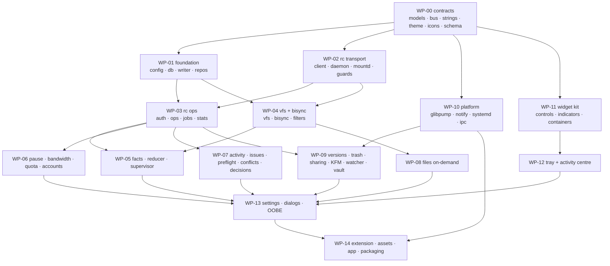

# OneDriveUI — Parallel Build Plan

**93 Python modules + 1 SQL schema, in 15 work packages (WP-00 … WP-14).**

The rule that makes this parallelisable: **every file has exactly one owning package.** No package edits a
file another package owns. The only shared files are the ten frozen contracts in WP-00, which are written
first and then read-only forever.

| | |
|---|---|
| **Wave 0** | WP-00 alone. Nothing else may start. ~4 h, one agent. |
| **Wave 1** | WP-01, WP-02, WP-10, WP-11 — in parallel. Only WP-00 imports. |
| **Wave 2** | WP-03, WP-04 (need WP-02); WP-12 (needs WP-11) — in parallel. |
| **Wave 3** | WP-05 … WP-09 — in parallel. All need WP-01…WP-04. |
| **Wave 4** | WP-13 (needs WP-11, WP-12 and the WP-05…WP-09 signatures); WP-14. |

Waves are dependency ordering, not scheduling: an agent in a later wave may start against the **frozen
signatures** in `CONTRACTS.md §10` before the implementing package has landed, using the `FakeRc` /
`FakeServices` fixtures. Only integration testing is gated on the real wave.

---

## Shared rules for every package

1. **Read `docs/CONTRACTS.md` first.** Import from the frozen modules; never redeclare an enum, a Signal, a
   colour, an icon name, a user-facing string or a magic number.
2. **Never modify a file you do not own.** If a contract is genuinely wrong, raise it with the WP-00 owner;
   do not patch it locally.
3. **Every module ships `tests/test_<module>.py`** and passes with no live rclone, using the WP-00 fixtures.
4. **The 15 hard invariants (`ARCHITECTURE.md §3`) are enforced in code, not in comments.** Any path that
   touches rclone argv, eviction, bisync or the mount goes through `rc/guards.py`.
5. **Threading rules (`ARCHITECTURE.md §7`) are absolute.** No `QWidget` off the GUI thread, no `Gio` off
   the GUI thread, no SQLite write outside `DbWriter`, no synchronous HTTP on the GUI thread.
6. **UI packages never call a service directly.** Every world-changing user action goes through
   `Supervisor.do(action, **kw)` or emits a `BUS` signal.
7. **Definition of done** = acceptance criteria met + tests green + the `CONTRACTS.md §11` compliance
   checklist passes.

---

## WP-00 — Frozen contracts  *(Wave 0 · blocks everything · 1 agent)*

**Owns**

```
onedriveui/__init__.py
onedriveui/models.py
onedriveui/bus.py
onedriveui/constants.py
onedriveui/errors.py
onedriveui/strings.py
onedriveui/paths.py
onedriveui/data/schema.sql
onedriveui/ui/theme.py
onedriveui/ui/icons.py
tests/conftest.py
tests/fakes/__init__.py
tests/fakes/fake_rc.py          # a dict-backed rc server: no rclone needed anywhere
tests/fakes/fake_fs.py          # a temp vfs/ + vfsMeta/ tree with synthetic sidecars
tests/fakes/fake_services.py    # stub Supervisor / Pinner / IssueEngine for UI tests
```

**May import** stdlib, `PySide6.QtCore` (in `bus.py` only), `PySide6.QtGui` (in `ui/icons.py` only).
**Nothing else.** `models.py` in particular must import **only** the stdlib.

**Deliver**
- Everything in `CONTRACTS.md §0–§8`, verbatim, as running code.
- `ui/theme.py`: the pre-composited token tables, the two accent ramps, geometry, the type ramp, motion
  curves, `T()`, `stylesheet()`, `ThemeManager`.
- `ui/icons.py`: the name registry plus `install_theme_icons()`. The SVG *assets* land in WP-14; this
  package ships the names, the loader and placeholder SVGs so nothing 404s.
- `data/schema.sql`: the full DDL from `ARCHITECTURE.md §10`, plus `migrations/001_initial.sql`.
- `FakeRc`: a class exposing `RcClient`'s surface over a dict of canned responses, with the real quirks
  baked in — `transferring`/`checking`/`lastError` **omitted** when empty, `eta` sometimes `null`,
  `checking` a list of **strings**, `operations/stat` returning HTTP 200 `{"item": null}` for a missing
  path while `operations/list` returns 404, `vfs/refresh` rejecting a JSON boolean for `recursive`.

**Acceptance**
- `python -c "import onedriveui.models, onedriveui.bus, onedriveui.strings, onedriveui.ui.theme"` succeeds.
- `T(tok, dark=d, on=s)` returns a valid `#RRGGBB` for every token × 2 themes × 2 surfaces; an unknown
  token raises `KeyError`.
- `QColor(T(tok))` is valid and opaque for all of them.
- `STATUS_LINE` and `TRAY_FOR_STATE` each cover **every** `SyncState` member (parametrised test).
- `ISSUE_TITLE` and `ACTIONS_FOR` each cover **every** `IssueCode` member.
- `TOAST` covers every `NotificationId`; no entry has more than 2 actions.
- `errors.classify()` returns the documented code for one representative string per row of the
  `ARCHITECTURE.md §12.2` table (28 cases), and `is_benign()` is `True` for all six benign patterns.
- Every dataclass is `frozen=True, slots=True` and is picklable.
- `sqlite3` executes `schema.sql` cleanly into `:memory:`.
- `paths.fuse_rclone_mounts()` finds the live `~/OneDrive` mount on this machine.

---

## WP-01 — Foundation: config, storage, logging  *(Wave 1)*

**Owns**

```
onedriveui/atomicio.py
onedriveui/config.py
onedriveui/units.py
onedriveui/applog.py
onedriveui/data/__init__.py
onedriveui/data/db.py
onedriveui/data/writer.py
onedriveui/data/repo_sync.py
onedriveui/data/repo_files.py
```

**May import** WP-00, stdlib, `PySide6.QtCore`.

**Deliver**
- `atomicio`: tmp → fsync → `os.replace` → fsync-dir; `.bak`; `md5_of_file()` byte-identical to `md5sum`;
  `pid_is_alive(pid, starttime)` reading `/proc/<pid>/stat` field 22.
- `config`: all 15 section dataclasses from `ARCHITECTURE.md §9`, load/save/migrate/validate. Validation
  **rejects** `transfers > 4`, `checkers > 8`, a `chunk_size` that is not a multiple of 320 KiB, a
  `poll_interval_s >= dir_cache_time_s`, and a `sync_root` under an existing fuse mount.
- `units`: `kb_to_kib()` is **the** conversion — no other module may inline it.
- `applog`: rotating log, 500-line ring buffer, `redact()` (access_token, refresh_token, rc-pass,
  `auth?state=`, `Authorization:`), and `build_diagnostics_bundle()` that uses
  `rclone config redacted` — **never** `config/dump` or `config/get` (invariant I14).
- `data/db`: WAL + `synchronous=NORMAL` + `busy_timeout=5000` + `foreign_keys=ON`; `open_rw()` returns
  exactly one connection; `open_ro()` is thread-local; refuses to open under a fuse mount;
  `integrity_check()` renames to `state.db.corrupt-<ts>` and recreates.
- `data/writer`: the single writer `QThread`, 100 ms batched transactions, `urgent=True` for latches and
  decisions.
- The two repos, with the generation-based `cache_index` upsert and the partial-unique constraints.

**Acceptance**
- Killing the process mid-`atomic_write_json` (simulated) never leaves a truncated `config.json`; the
  `.bak` always parses.
- A corrupt `config.json` loads with all defaults and raises no exception.
- `kb_to_kib(1000) == 977`; `format_bwlimit(1000, 100)` produces an rclone-parseable rate string.
- 10 000 `submit()` calls from 4 threads land in order, in ≤ 110 batches, with no `database is locked`.
- `urgent=True` is durable before `submit_sync` returns (verified by reading from a second connection).
- `redact()` removes a real-shaped OAuth token from a log line; a bundle built from a fixture contains
  **zero** occurrences of `refresh_token`.
- `upsert_cache_rows(gen=N)` followed by `prune_cache_generation(N-1)` leaves only generation-N rows; an
  **interrupted** scan (rows for N written, prune not run) leaves the old rows intact.

---

## WP-02 — rc transport, daemons, guards  *(Wave 1)*

**Owns**

```
onedriveui/rc/__init__.py
onedriveui/rc/client.py
onedriveui/rc/endpoints.py
onedriveui/rc/daemon.py
onedriveui/rc/mountd.py
onedriveui/rc/guards.py
onedriveui/rc/conf.py
```

**May import** WP-00, WP-01, `PySide6.QtCore`, `PySide6.QtNetwork`. **May not** import `platform/systemd.py`
directly — depend on its frozen signature and inject it, so WP-02 and WP-10 can proceed in parallel.

**Deliver**
- `client`: `QNetworkAccessManager` async client + `call_blocking()` twin. POST only; basic auth;
  4 s default timeout; `deleteLater()` on every reply; `_async`/`_group`/`_config`/`_filter`; parses the
  4-key error envelope; reads `X-Rclone-Jobid`. `JobWatcher` distinguishes **expired** (500 `job not found`
  + unchanged `execute_id`) from **lost** (`execute_id` changed).
- `endpoints`: bind-probe over 17800–17899 skipping `RC_FORBIDDEN_PORTS`; `secrets.token_urlsafe(32)`
  credentials; `endpoints.json` at mode 0600.
- `daemon`: `RcdSupervisor` writing/enabling/starting the unit, waiting for `rc/noop`, and running
  `verify_ownership()` (`core/pid` → `/proc/<pid>/cmdline` must contain `rcd` **and** our exact
  `--rc-addr`) plus the `starttime` anti-PID-reuse check.
- `mountd`: `build_argv()` (exactly the argv in `ARCHITECTURE.md §5.3`), `unit_text()` with `Type=notify`
  and `ExecStop=fusermount3 -uz`, `is_live()` = `/proc` **and** `statvfs` (I6), the restart ladder that
  **refuses while `uploads_in_progress > 0`** unless already stale (I3), `status_text()` from
  `systemctl show -p StatusText`.
- `guards`: all seven refusals, each raising `SafetyRefusal`.
- `conf`: atomic `rclone.conf` read/write; `set_backend_options()` is the **only** way a backend option is
  ever set; `recommended_backend_options("personal")` returns `no_versions=false`, `hard_delete=false`,
  `delta=true`, `chunk_size=10M`.

**Acceptance**
- Against a **real** throwaway `rclone rcd` on a probed port: `core/version`, `rc/noop`, `core/stats`,
  `job/list` all round-trip in under 50 ms on the GUI thread; `job/list.executeId` is stable across calls
  and changes after a restart.
- `verify_ownership()` returns `False` for the pre-existing foreign rclone on 127.0.0.1:5572 and the
  supervisor raises `DaemonForeign` rather than driving it.
- `pick_free_port()` never returns 5572, 5573 or 53682.
- `assert_no_backend_flags(build_argv(...))` passes; injecting `--onedrive-chunk-size 30M` raises
  `SafetyRefusal` with invariant `"I1"`.
- `assert_not_under_fuse(Path("~/OneDrive/x").expanduser(), "sync")` raises on this machine.
- `is_live()` returns `UP` for the live mount; after `kill -9` on a scratch mount it returns `STALE`
  while `os.path.ismount()` still returns `True`.
- `set_backend_options()` round-trips through `rclone.conf` and leaves the `token` line byte-identical.

---

## WP-03 — rc operations, auth, jobs, stats  *(Wave 2 · needs WP-02)*

**Owns**

```
onedriveui/rc/auth.py
onedriveui/rc/ops.py
onedriveui/rc/jobs.py
onedriveui/rc/stats.py
```

**May import** WP-00, WP-01, WP-02.

**Deliver**
- `ops`: typed wrappers encoding the traps — `Path` is relative to `fs` **not** `fs`+`remote` (build rows
  from `Name`); `stat` returns HTTP 200 `{"item": null}` while `list` returns 404; `uploadfile` puts its
  params in the **query string** and names the destination from the multipart `filename=`; OneDrive
  directories report `Size: -1`; `size()` and `check()` are **always** `_async` because `ListR=false`.
  `Capabilities.name` strips a `{HASH}` suffix before display.
- `auth`: the full rc OAuth walk — `config/create` with `_async:true` and `opt.nonInteractive`, poll
  `config/oauthstatus` for `{"status":"running","authUrl":"http://127.0.0.1:53682/auth?state=…"}`, open it
  with `QDesktopServices`, poll `job/status`, cancel with `config/oauthstop`. Checks
  `callback_port_free()` first. `rclone authorize onedrive --auth-no-open-browser` as the fallback (link on
  **stderr**, token blob on **stdout** between the paste markers). `probe_token()` classifies via
  `AUTH_PATTERNS`; `keepalive()` runs a cheap `about` every 24 h so the refresh token never hits the 90-day
  non-use expiry.
- `jobs`: `JobRegistry` with a stable `_group` per user-visible operation, `core/stats-delete` cleanup, and
  `invalidate_all(reason)` on an `execute_id` change.
- `stats`: adaptive poller using `.get()` **everywhere** (`transferring`/`checking`/`lastError` are omitted
  when empty; `eta` can be `null`; `checking` is `list[str]`). `drain_transferred()` reads
  `started_at`/`completed_at`/`group`/`srcFs`/`dstFs` — **not** the `timestamp`/`jobid` its own help
  documents — and persists before any `reset_group()`.

**Acceptance**
- `parse_stats({})` returns a valid `CoreStats` with empty tuples and raises nothing.
- `parse_stats()` handles a captured mid-transfer payload including `srcFs`/`dstFs`/`group`.
- `list_dir(fs="onedrive:", remote="Docs")` builds rows whose `rel_path` is `Docs/<name>`, proving `Path`
  was not used naively.
- `stat()` on a missing path returns `None`; `list_dir()` on a missing dir raises `RcError.is_not_found`.
- `probe_token()` maps `AADSTS65005` → `TENANT_BLOCKED` and `AADSTS50076` → `MFA` (they are different
  states: only the latter is fixed by re-auth).
- `JobWatcher` on a job the fake daemon expires emits `expired`, not `failed`; after an `execute_id`
  change it emits `lost`.
- Live smoke test: `about("onedrive:")` returns a `QuotaInfo` whose `total`/`used`/`free` are non-zero.

---

## WP-04 — VFS cache, bisync, filters  *(Wave 2 · needs WP-02)*

**Owns**

```
onedriveui/rc/vfs.py
onedriveui/rc/bisync.py
onedriveui/rc/bisync_log.py
onedriveui/rc/filters.py
```

**May import** WP-00, WP-01, WP-02.

**This is the highest-risk package in the project.** `vfs.evict()` is the one function that can destroy
user data. It gets the most test coverage.

**Deliver**
- `vfs`: `disk_cache_info()` from `vfs/stats` (I4); `classify()` per the `Rs` rules; `scan()` as an
  IOPool-safe generator; `local_extents()` via `SEEK_DATA`/`SEEK_HOLE` with a sidecar fallback on `EINVAL`;
  `evict()` = `assert_evict_safe` → unlink **meta** → unlink **data** (I5); `defer_uploads()` (how pause
  actually works); `orphaned_cache_trees()`; `refresh()` sending `recursive` as the **string** `"true"`.
- `bisync`: `build_argv()` exactly as `ARCHITECTURE.md §5.4`; `session_name()` implementing
  `sanitize(ConfigString(p))` — replace every character outside `[A-Za-z0-9.-]` with `_`, strip a leading
  `_`, join with `..` — **and validating the result fits in `NAME_MAX - 16`**, because there is no hashing
  fallback; `workdir_state()` reading `.lst`/`.lst-err`/`.lck`; `read_lock()` parsing the lock JSON and
  treating it as stale when the PID is dead or `TimeExpires` has passed; `adopt()` via
  `systemctl --user is-active`; `seed_check_access()` (RCLONE_TEST files must exist **before**
  `--check-access` is enabled — it is enforced during `--resync` too).
- `bisync_log`: `LogTailer(QThread)` resuming from a byte offset; `parse_record()` for all three shapes;
  `classify_verdict()` reading the **log**, since exit 130 is ambiguous; `strip_rcd_prefix()`;
  `is_benign()` filtering.
- `filters`: `render()` with `MANDATORY_EXCLUDES` (`- *.partial`, `- .Trash-1000/`, `- .onedriveui-trash/`,
  `- .onedriveui-versions/`, `- *.tmp`, `- ~$*`, `- desktop.ini`, `- .DS_Store`, `- *.one`, `- *.onetoc2`);
  `write()` returning `True` when the content changed, which the caller **must** pair with a `--resync`
  (I11); the `.md5` sidecar (32 lowercase hex, mode 0600, **no trailing newline**).

**Acceptance**
- `classify()` is correct for all six fixture shapes: no sidecar, `Rs: null`, `Rs: []`, one full range, two
  partial ranges, and `Dirty: true` + `Fingerprint: ""`.
- `local_extents()` on a synthetic sparse file returns ranges **byte-identical** to its sidecar `Rs`.
- `evict()` on a `Dirty:true` item raises `SafetyRefusal` and **touches no file** (asserted by mtime).
- `evict()` on an item present in `vfs/queue` raises `SafetyRefusal`.
- `evict()` on a clean item unlinks meta **strictly before** data (asserted by ordering the fake
  filesystem's calls); killing between the two leaves a data file with no metadata, which `classify()`
  reads as `ONLINE_ONLY`.
- `session_name("/tmp/x/p1", "/tmp/x/p2") == "tmp_x_p1..tmp_x_p2"`;
  `session_name("od:/tmp/y", ...)` starts `od__tmp_y`; a 300-char path raises before any run starts.
- `classify_verdict()` returns the right verdict for all nine captured terminal lines, and returns
  `NEEDS_RESYNC` (not `OK`) for an exit-130 run whose log ends in `Must run --resync to recover.`
- `render()` output survives `rclone lsf --filter-from -` without a parse error.
- `write()` returns `False` when the content is unchanged, so a no-op settings save never forces a resync.

---

## WP-05 — Facts, reducer, supervisor  *(Wave 3)*

**Owns**

```
onedriveui/sync/__init__.py
onedriveui/sync/facts.py
onedriveui/sync/reducer.py
onedriveui/sync/supervisor.py
```

**May import** WP-00 … WP-04, and the frozen signatures of WP-06 … WP-10 (injected, not imported at module
scope, so `reducer.py` stays importable with zero dependencies).

**`reducer.py` must import nothing but `models` and `strings`.** No Qt, no I/O. This is checked by a test.

**Deliver**
- `facts.FactCollector`: the adaptive tick, every source individually `try`/`except`ed with a 1500 ms
  budget, a stale source carrying forward its previous value and being named in `facts.stale`.
- `reducer`: the 17-rung `LADDER`, `Debouncer` (severe 1 / normal 2 / `UP_TO_DATE` 3, `PROCESSING` 250 ms
  entry delay, `MOUNTING` suppressed 15 s after a deliberate restart), `status_text()`, `tooltip()`,
  `tray_for()`, `transition_effects()`.
- `supervisor`: the tick loop, effect execution, the mount restart ladder (10/30/120/600 s, max 3/hour),
  the scheduled jobs (weekly `rclone check`, 6-hourly cache scan, daily token keepalive, hourly prune,
  15-min quota), latch set/clear, and `do(action, **kw)` — **the single entry point** for every user action.

**Acceptance**
- `reduce()` has a parametrised test per rung asserting that rung wins over every rung below it — 17 cases
  plus 16 "outranks" cases.
- `reduce()` is deterministic: 1 000 random `Facts` produce identical results across two runs, and calling
  it never touches the filesystem (asserted with a patched `open`).
- With `transfers_active=2` **and** `issues_error=3`, the state is `SYNCING` (not `WARNING`) — the
  Windows behaviour of showing progress with a persistent issues banner beneath.
- `Debouncer` needs 3 quiet ticks to reach `UP_TO_DATE` and 1 tick to reach `ERROR`.
- A simulated `SIGKILL` (discard the collector, rebuild from the fixtures on disk) produces a **byte-equal**
  `SyncState` — this is the crash-recovery property, and it is the single most important test in the repo.
- `restart_mount()` is a no-op (with a logged reason) while `uploads_in_progress > 0` and health is `UP`.
- `request_resync()` without an answered decision row raises `SafetyRefusal` (I15).
- `do()` covers every `RecoveryAction` member; an unhandled action raises rather than silently passing.

---

## WP-06 — Pause, bandwidth, quota, accounts  *(Wave 3)*

**Owns**

```
onedriveui/sync/pause.py
onedriveui/sync/bandwidth.py
onedriveui/sync/quota.py
onedriveui/sync/accounts.py
```

**May import** WP-00 … WP-04 and `platform/power.py`'s frozen signature.

**Deliver**
- `pause`: manual 2/8/24 h + "Until I resume" with a persisted `paused_until` and a re-armed timer;
  automatic metered/battery with **no** timeout (they last until the condition clears); `sync_anyway()`
  setting a per-reason override window; `enforce()` re-deferring every `vfs/queue` item each tick. **Never
  unmounts** — reads of already-cached files must keep working, matching Windows.
- `bandwidth`: `core/bwlimit` applied to **both** daemons (the mount daemon is the one that moves bytes);
  KB/s→KiB/s through `units.kb_to_kib()` only; the 50 KB/s floor; `AutoUploadController` sampling
  throughput every 30 s, setting 70 %, and lifting the limit for 60 s each period.
- `quota`: 5-min TTL, forced refresh after a large job, the four tiers, and the 507 → `quota_exceeded`
  latch.
- `accounts`: enumerate via `config/listremotes` filtered to `type=onedrive`; `resolve_identity()` capturing
  the display name at OAuth or reading `created-by-display-name` off a user-owned file, because
  `Features.UserInfo` is **false** for OneDrive; `unlink()` doing `config/delete` + unit teardown and
  **never** touching the local folder.

**Acceptance**
- `pause(MANUAL, 2)` persists; restarting the process still reports paused with the correct remaining time.
- `enforce()` issues one `vfs/queue-set-expiry` per queue entry per tick; `id not found in queue` is
  swallowed as the normal ~5 s race it is, not raised.
- Resume drains deferred items with `expiry=-1e9`.
- Metered auto-pause clears itself the moment `NetworkMonitor` reports unmetered; manual pause does not.
- `apply()` never string-compares the echoed rate (rclone normalises `1M:100k` → `1Mi:100Ki`).
- `apply()` is re-issued after a `daemon_restarted` signal.
- `unlink()` leaves every file under `sync_root` present (asserted by a before/after tree hash).

---

## WP-07 — Activity, issues, preflight, conflicts, decisions  *(Wave 3)*

**Owns**

```
onedriveui/sync/activity.py
onedriveui/sync/issues.py
onedriveui/sync/preflight.py
onedriveui/sync/conflicts.py
onedriveui/sync/decisions.py
```

**May import** WP-00 … WP-04.

**Deliver**
- `activity`: merge the three sources, dedupe on `sha1(group|name|completed_at)`, cap at 5 000 rows/account,
  mark everything `inflight` as `interrupted` on a `daemon_restarted`. **Never** calls `core/stats-reset`
  implicitly — the reset also wipes `core/transferred`.
- `issues`: upsert on `(account, code, rel_path)` bumping `occurrences`; `reconcile()` auto-resolving;
  `execute()` for all 18 `RecoveryAction`s.
- `preflight`: pure validation; `suggest()` deterministic.
- `conflicts`: the live bisync-log regex **and** a durable glob of `**/*.conflict[0-9]*` and
  `*-<hostname>.*`; `conflict_suffix()` = `"-" + socket.gethostname().split(".")[0]`, reproducing
  `MyFile.docx → MyFile-LaptopName.docx` byte-for-byte; both Windows policies.
- `decisions`: crash-surviving decisions; `expire_stale()` where **expiry means DO NOT DELETE**;
  `on_maxdelete_abort()` parsing `Safety abort: too many deletes (>N%, n of m) on PathX` and **never**
  auto-retrying with `--force`.

**Acceptance**
- Feeding the same `core/transferred` payload twice inserts one row.
- 10 000 activity inserts leave exactly 5 000 rows and the newest is retained.
- `validate_name()` rejects every char in `INVALID_CHARS`, every `RESERVED_NAMES` entry, a trailing space,
  a trailing period, a leading tilde and a `~$` prefix — and **accepts** a plain `My Report (final).docx`.
- `suggest("a:b?.txt")` is deterministic across runs and passes `validate_name()`.
- `conflict_suffix()` on this machine produces the real short hostname.
- A decision created 8 days ago and unanswered is expired by `expire_stale()` and its payload records that
  **nothing was deleted**.
- `on_maxdelete_abort()` creates exactly one decision and issues **zero** rclone commands.

---

## WP-08 — Files On-Demand  *(Wave 3)*

**Owns**

```
onedriveui/sync/pinner.py
onedriveui/sync/filestate.py
onedriveui/sync/browse.py
onedriveui/sync/selective.py
```

**May import** WP-00 … WP-04.

**Deliver**
- `pinner`: `pin`/`unpin`/`free_up_space`/`free_up_all`/`download_all`, ≤3 concurrent hydrations,
  4 MiB sequential reads with `buffering=0` (never `sendfile`/`copy_file_range` through FUSE), progress
  from `SEEK_DATA`, and `RepinWatcher` re-queuing evictor victims found via `IN_DELETE` on `vfsMeta` or the
  journal line `removed cache file as Removing old cache file not in use`.
- `filestate`: merge cache state + pins + shares + open issues + exclusions into `cache_index`;
  `statuses()` must be **O(1) per path** because the Nautilus IPC answers from it within 20 ms.
- `browse`: lazy `dirsOnly` tree, TTL cache, `size()` always `_async`.
- `selective`: write filters → **mandatory resync** → prune only after success (excluding a folder never
  deletes it); prune goes to the freedesktop Trash (I10); `as_mount_excludes()` for the mount-only path.

**Acceptance**
- Pinning a file the fake evictor then deletes results in a **re-queued** pin within one watcher cycle.
- `free_up_space()` on a `Dirty` item refuses and raises a `SyncIssue`, not an exception to the user.
- `statuses()` for 1 000 paths returns in under 10 ms against a warm `cache_index`.
- `download_all()` respects `MAX_CONCURRENT_PINS` under a 500-file fixture.
- `apply(excluded)` that fails its resync does **not** prune anything locally.
- A filters-file edit paired with a resync leaves `filters.txt.md5` matching `md5sum`.

---

## WP-09 — Versions, trash, sharing, KFM, watcher, extras, vault  *(Wave 3)*

**Owns**

```
onedriveui/sync/versions.py
onedriveui/sync/trashbin.py
onedriveui/sync/sharing.py
onedriveui/sync/kfm.py
onedriveui/sync/watcher.py
onedriveui/sync/extras.py
onedriveui/sync/vault.py
```

**May import** WP-00 … WP-04, `platform/{trash,desktop,secrets,notify,glibpump}.py` signatures.

**Deliver**
- `versions`: index bisync `--backup-dir` snapshots; `restore_version()` captures the current copy first;
  `web_version_url()` for the server-side history rclone cannot list.
- `trashbin`: `soft_delete()` as a server-side `operations/movefile` into `.onedriveui-trash/<ts>/`;
  restore; retention purge. **`operations/cleanup` appears nowhere** (I8).
- `sharing`: `create_link()`; `can_revoke()` returns `False` **always**, and the UI shows the control
  disabled with `DIALOG.REMOVE_LINK_WHY`; `mailto_url()` fallback.
- `kfm`: two-phase copy-verify-then-remove with a resumable journal; atomic `user-dirs.dirs` rewrite +
  `xdg-user-dirs-update`; the "Where are my files" shortcut; `rollback()`.
- `watcher`: `Gio.FileMonitor` on the sync root + raw inotify on `vfsMeta`; 400 ms coalescing;
  `delete_burst()` against the 200-item threshold; `intercept_trash_dir()` for `~/OneDrive/.Trash-1000`,
  which **already exists on this machine** and syncs straight to the cloud.
- `extras`: screenshot watcher, camera import via `GVolumeMonitor`.
- `vault`: gocryptfs + libsecret; the 20/60/120/240-min auto-lock; the T−5 warning toast; honest labelling.

**Acceptance**
- `soft_delete()` issues exactly one `operations/movefile` and **zero** deletes.
- `restore_from_trash()` round-trips a file to its original `rel_path`.
- `can_revoke()` is `False`, and no code path calls `publiclink` with `unlink=true`.
- A KFM run interrupted after phase 1 is resumed by `rollback()`/`execute()` with **no data loss**
  (before/after tree hashes match).
- `intercept_trash_dir()` drains a planted `~/OneDrive/.Trash-1000/files/x` into the real Trash and raises
  an `ORPHANED_CACHE`-class issue.
- `delete_burst()` counts 250 deletions inside 60 s and creates exactly one `MASS_DELETE` decision.
- The vault's 5-minute warning fires once, not per tick.

---

## WP-10 — Platform integration  *(Wave 1)*

**Owns**

```
onedriveui/platform/__init__.py
onedriveui/platform/glibpump.py
onedriveui/platform/dbus.py
onedriveui/platform/notify.py
onedriveui/platform/power.py
onedriveui/platform/systemd.py
onedriveui/platform/autostart.py
onedriveui/platform/singleinstance.py
onedriveui/platform/desktop.py
onedriveui/platform/trash.py
onedriveui/platform/ipc.py
onedriveui/platform/secrets.py
onedriveui/platform/thumbnails.py
```

**May import** WP-00, WP-01, `PySide6`, `gi`.

**`glibpump.py` is the critical path.** If it stalls, notifications, metered detection and theme changes
all stop *silently*. Build and verify it first.

**Deliver**
- `glibpump`: the 50 ms pump, asserting it runs on the GUI thread.
- `notify`: **Gio only** — `GLib.Variant("(susssasa{sv}i)")`, `urgency` as GVariant **BYTE `y`**,
  `desktop-entry` hint, stable `replaces_id`, `GLib.markup_escape_text()` on every filename (body-markup is
  on), `ActionInvoked`/`NotificationClosed` routing, per-toast throttling, `MAX_ACTIONS = 2`.
  **`QSystemTrayIcon.showMessage` is banned** — it silently loses action buttons.
- `power`: `Gio.NetworkMonitor` + `Gio.PowerProfileMonitor` primary, NM `Metered ∈ {1,3}` / UPower /
  PowerProfiles (try `org.freedesktop.UPower.PowerProfiles` then `net.hadess.PowerProfiles`) as fallback.
- `systemd`: `org.freedesktop.systemd1` D-Bus; `run_transient()`; **never emits `network-online.target`**,
  which does not exist in the user manager.
- `autostart`: **either** the unit **or** the XDG entry, never both.
- `singleinstance`: `QLocalServer` at an explicit `$XDG_RUNTIME_DIR` path + `QLockFile`.
- `desktop`: `FileManager1.ShowItems`, bookmarks, icon install + `gtk4-update-icon-cache`, `device_id()` =
  `sha256(/etc/machine-id)[:16]` (**never** the raw value).
- `trash`: every local removal goes to the freedesktop Trash (I10); nested-trash draining.
- `ipc`: the NDJSON server with the 20 ms budget and the push channel.

**Acceptance**
- `Notifier.notify()` with two actions produces a real GNOME bubble whose buttons fire `action_invoked`
  (verified live on this machine), and re-notifying the same id **replaces** the bubble rather than
  stacking.
- `notify()` with `urgency=2` does not raise a GVariant type error (the `y`-vs-`i` trap).
- `capabilities()` returns the six advertised on this machine.
- The pump keeps a `Gio.FileMonitor` callback firing while a 200 ms Qt-side operation runs.
- `power.metered()` returns `False` on this machine (NM reports `uint32 4` = GUESS_NO) and flips under a
  patched fake.
- `singleinstance` puts its socket under `/run/user/1000/onedriveui/`, **not** `/tmp`; a second launch
  connects and exits 0.
- `desktop-file-validate` passes on the generated `.desktop` with **no** category warning.
- `IpcServer` answers a 1 000-path `state` query in under 20 ms and never blocks.

---

## WP-11 — Fluent widget kit  *(Wave 1)*

**Owns**

```
onedriveui/ui/__init__.py
onedriveui/ui/fonts.py
onedriveui/ui/qss.py
onedriveui/ui/motion.py
onedriveui/ui/widgets/__init__.py
onedriveui/ui/widgets/controls.py
onedriveui/ui/widgets/indicators.py
onedriveui/ui/widgets/containers.py
onedriveui/ui/widgets/lists.py
onedriveui/ui/widgets/chrome.py
```

**May import** WP-00, `PySide6`. **No engine imports at all** — this package must be renderable in a
standalone gallery script with zero rclone.

**Deliver**
- `fonts`: `addApplicationFontFromData` from package data; **filter candidates against
  `QFontDatabase.families()`** because fontconfig substitutes every unknown family;
  `setPixelSize` never `setPointSize`; `DemiBold(600)` never `Bold(700)`.
- `qss`: the full stylesheet, with every workaround — a `border` declaration on every `QPushButton` (or
  Fusion paints a gradient), `WA_StyledBackground` on `QWidget` subclasses, scoped selectors only, and the
  focused-`QLineEdit` padding compensation.
- `motion`: explicit `BezierSpline` curves; every duration through `theme.duration()`.
- `controls`: the **Windows 11** `ToggleSwitch` — 40×20 track, 12 px knob, 0→20 travel, 14 px on hover,
  17×14 on press, 83 ms, KeySpline `0,0,0,1`. Not the legacy Windows 10 44×20/10 px template that ships in
  `microsoft-ui-xaml@main`. Four button variants; the two-tone focus ring (2 px outer + 1 px inner,
  inflated 3 px, ring radius = control radius + 3, **no accent**).
- `indicators`: `ProgressRing` (arc angles in 1/16°, 0 = 3 o'clock, clockwise from 12 with start `90*16`
  and a **negative** span; stopped in `hideEvent`); `FluentProgressBar` (3 px fill over a **1 px** track);
  `StorageBar`; `Avatar`; the status-badge painter.
- `containers`: `SettingsCard`, `SettingsExpander`, `InfoBar`, `ContentDialog` with reserved shadow margin.
- `lists`: the activity delegate with `sizeHint` returning **width 0**; the tri-state folder tree with
  both-direction propagation and a re-entrancy guard.
- `chrome`: `NavigationView`, `SearchBox`, `StatusGlyph`.

**Acceptance**
- A `FluentButton` measures **exactly** `QSize(55, 32)` offscreen; removing `min-height` gives 33, proving
  the recipe is load-bearing.
- A `FluentLineEdit` is 32 px both unfocused and focused (the padding compensation works).
- `ToggleSwitch` knob travel is 0→20 and the knob is 12 px at rest, 14 hovered, 17×14 pressed.
- Every widget renders correctly at both themes and at `devicePixelRatio` 1.0, 1.25, 1.5 and 2.0 — a
  contact sheet is produced and visually inspected.
- No widget uses a colour, icon name or string literal not sourced from WP-00 (grep test).
- A full-width list view shows **no** horizontal scrollbar (`sizeHint` width 0).
- With animations disabled, every `QPropertyAnimation` has duration 0 and the end value is applied.
- A gallery script renders all widgets with **zero** imports outside `onedriveui.ui` and `onedriveui`
  contracts.

---

## WP-12 — Tray, Activity Center, notices, browser  *(Wave 2 · needs WP-11)*

**Owns**

```
onedriveui/ui/tray.py
onedriveui/ui/activity_center.py
onedriveui/ui/activity_model.py
onedriveui/ui/notices.py
onedriveui/ui/filebrowser.py
```

**May import** WP-00, WP-11, `platform/{tray-adjacent}` signatures, and the WP-05…WP-09 **signatures**
(injected). Uses `FakeServices` until Wave 3 lands.

**Deliver**
- `tray`: one SNI item per account; `QIcon.fromTheme` **only** (never a pixmap); the 125 ms spinner started
  and stopped by state change; a **label-only** DBusMenu (no `QWidgetAction` — it exports as an empty
  label); "Open Activity Center" first and default, because GNOME's AppIndicator maps left-click to opening
  the menu; the vault reflow quirk (while locked, "Quit" nests under "Pause syncing").
- `activity_center`: a **normal top-level `Qt.Tool` window**, 360 px, with the account name **always**
  visible in the header even in error states; storage block; banner; activity list; footer.
- `activity_model`: live `transferring[]` rows first, then history, deduped by `dedupe_key`.
- `notices`: the single place a state/latch/event becomes a toast and a banner, honouring the Notifications
  settings and routing every action button back onto the bus.
- `filebrowser`: the virtualised tree with a Status column and the same context actions as the Nautilus
  submenu.

**Acceptance**
- The tray icon changes for all 17 `SyncState`s (driven by a scripted `FakeServices`) and never flickers
  under a 2.5 Hz fact tick.
- The spinner stops when leaving `SYNCING`/`PROCESSING` and on `hideEvent`.
- The Activity Center header shows the account name while the state is `ERROR`.
- The status line, the tooltip and the banner are all produced from `reducer.status_text()` — a grep test
  asserts no status literal in these files.
- Every user action reaches `Supervisor.do()` or a `BUS` signal; no direct service call (grep test).
- The activity list scrolls 5 000 rows at 60 fps with no horizontal scrollbar.
- Live check on this machine: the SNI item registers with `org.kde.StatusNotifierWatcher` and the menu
  renders.

---

## WP-13 — Settings, dialogs, OOBE  *(Wave 4)*

**Owns**

```
onedriveui/ui/settings_window.py
onedriveui/ui/pages/__init__.py
onedriveui/ui/pages/page_sync.py
onedriveui/ui/pages/page_account.py
onedriveui/ui/pages/page_notifications.py
onedriveui/ui/pages/page_about.py
onedriveui/ui/dialogs/__init__.py
onedriveui/ui/dialogs/base.py
onedriveui/ui/dialogs/sync_dialogs.py
onedriveui/ui/dialogs/file_dialogs.py
onedriveui/ui/dialogs/misc_dialogs.py
onedriveui/ui/wizard.py
```

**May import** WP-00, WP-11, WP-12, and the WP-05…WP-09 signatures.

**Deliver**
- The four-item NavigationView shell at 1024×720 with immediate-apply and deep-link navigation.
- `page_sync`: Manage backup, camera/screenshots, autostart, battery/metered, and the Advanced expander
  containing File collaboration, Bandwidth (KB/s + "Adjust automatically" + the global-scope note), Files
  On-Demand's **two buttons** each confirmed with "Continue", and Excluded extensions.
- `page_account`, `page_notifications`, `page_about` per `ARCHITECTURE.md §4.3`.
- All dialogs, including the Desktop-specific "This computer only" radio path and the mass-delete dialog
  carrying the 7-day non-dismissible note.
- Every control that cannot work on Linux renders **disabled with an inline reason**, never hidden — this
  is the "nothing is silently missing" principle.
- `wizard`: the 7-page OOBE, ending in `finalize()` — seed `RCLONE_TEST`, write filters, install units and
  icons, install the Nautilus extension, set autostart, start the mount.

**Acceptance**
- Every string in these files comes from `strings.py` (grep test: zero quoted user-facing literals).
- Toggling any setting writes `config.json` atomically and emits `config_changed` with the dotted key.
- A setting that requires a mount restart says so before applying (`options/set` on the `vfs` block does
  **not** affect a running VFS — it returns `{}` and changes nothing).
- The Share dialog's "Remove link" is **disabled** and shows `DIALOG.REMOVE_LINK_WHY`.
- The mass-delete dialog's primary button is "Restore files", not "Delete them".
- The Resync dialog states that resync only copies and may resurrect deleted files.
- The wizard completes end-to-end against `FakeRc` and leaves `first_run_complete=true` only on success.

---

## WP-14 — Nautilus extension, assets, entry points, packaging  *(Wave 4)*

**Owns**

```
onedriveui/ext/__init__.py
onedriveui/ext/nautilus_onedriveui.py
onedriveui/ext/install.py
onedriveui/app.py
onedriveui/__main__.py
pyproject.toml
assets/icons/status/*.svg         # 10 tray states + 8 spinner frames
assets/icons/emblems/*.svg        # the 8 emblem stems
assets/icons/apps/onedriveui.svg
assets/icons/glyphs/**            # Fluent UI System Icons (MIT), native sizes
assets/fonts/Inter*.ttf           # SIL OFL-1.1
packaging/onedriveui.desktop.in
packaging/onedriveui.service.in
packaging/onedriveui-rcd.service.in
packaging/onedriveui-mount@.service.in
```

**May import** everything. `ext/nautilus_onedriveui.py` may import **stdlib and `gi` only** — the
nautilus-python loader dlopens the *system* `libpython3.14.so.1.0` and cannot see our venv. **Importing
anything from the `onedriveui` package inside the extension fails at load with no useful error.** This is
enforced by a dedicated AST test.

**Deliver**
- The extension: `InfoProvider` (emblems + the Status column value), `ColumnProvider`, `MenuProvider`
  (guard: called with an **empty** list for the background menu), `PropertiesModelProvider`.
  `update_file_info` is **synchronous** off an in-memory dict — `Nautilus.OperationHandle` cannot be
  constructed from Python, so the async `IN_PROGRESS` path is unusable. Live refresh via
  `FileInfo.invalidate_extension_info()`. The IPC channel is a background `GLib.io_add_watch`. The module
  is imported **twice** per launch cycle, so any socket setup is guarded.
- `install`: symlink/copy the extension, install every SVG into hicolor, run `gtk4-update-icon-cache -f -t`,
  and tell the user Nautilus needs `nautilus -q` (it does not hot-reload).
- `app.py`: the composition root with the asserted `STARTUP_ORDER` and `install_crash_handler()`.
- `__main__.py`: the CLI.
- `pyproject.toml`: `setuptools` backend (hatchling is **not** installed and would force a network fetch);
  `python3 -m venv --system-site-packages` so the pacman PySide6 is used — **PySide6 must never be resolved
  from PyPI**, or it shadows the build compiled against the system Qt.
- Assets: the flat four-shape OneDrive mark (`#0364b8`/`#0078d4`/`#1490df`/`#28a8ea`, viewBox
  `0 5.5 32 20.5`, **wider than tall, never stretched to square**); all 10 tray states with a 10×10
  bottom-right badge and a 1 px cut-out ring; the 8 emblems.

**Acceptance**
- An AST test proves `ext/nautilus_onedriveui.py` imports nothing outside `{sys, os, json, socket,
  threading, gi, ...stdlib}`.
- The extension loads in a real Nautilus (`NAUTILUS_PYTHON_DEBUG=misc`) and all four provider hooks fire.
- Emblems appear on real files after `install_theme_icons()` + `gtk4-update-icon-cache` — verified under
  the machine's **breeze-dark** theme via the hicolor fallback, which is the case that silently fails
  without our own SVGs.
- `update_file_info` returns in under 1 ms with a cold cache (it answers `unknown` rather than blocking).
- `desktop-file-validate` passes; `xdg-mime query default x-scheme-handler/odopen` returns
  `onedriveui.desktop`.
- Tray SVGs are legible at 16 px (contact sheet at 16/22/24/32/48, visually inspected).
- `pip install -e . --no-build-isolation` inside `venv --system-site-packages` downloads **nothing** and the
  `onedriveui` console script runs.
- `STARTUP_ORDER` is asserted; `WAYLAND_DEBUG=1` shows `xdg_toplevel.set_app_id("onedriveui")`, not
  `"python3"`.

---

## Dependency graph



---

## Integration milestones

| M | Gate | Requires |
|---|---|---|
| **M1 — Engine breathes** | `onedriveui --state` prints a correct `SyncState` JSON against the live account, with no GUI | WP-00…WP-05 |
| **M2 — Tray is true** | Tray + Activity Center render live state; pause/resume work; the state survives a `SIGKILL` of the GUI | + WP-06, WP-11, WP-12 |
| **M3 — Files On-Demand** | Pin, free-up-space and download-all work end-to-end; badges are correct; no dirty item is ever evicted | + WP-08 |
| **M4 — Full surface** | Settings, all dialogs, OOBE, sharing, KFM, versions, trash, vault | + WP-07, WP-09, WP-13 |
| **M5 — Desktop native** | Nautilus emblems, Status column, context menu, toasts with actions, autostart, single instance | + WP-10, WP-14 |
| **M6 — Hardened** | Every invariant has a test; a 24 h soak with induced daemon kills, mount kills and network loss leaves zero data-loss events and zero stuck states | all |

---

## Risk register — what to watch during the build

| Risk | Owner | Early warning | Response |
|---|---|---|---|
| A `--onedrive-*` flag leaks onto a command line (I1) | WP-02 | `vfs/list` shows an `onedrive{HASH}:` name | `assert_no_backend_flags` fails the build; the About pane offers orphan-cache reclaim |
| A dirty cache item is evicted (I3) | WP-04, WP-08 | any `evict()` call not preceded by `assert_evict_safe` | fail the PR; this path has the highest test weight in the repo |
| The GLib pump stalls | WP-10 | notifications stop, theme changes stop, metered detection freezes — all **silently** | a watchdog logs when a pump iteration exceeds 200 ms |
| `reducer.py` acquires a dependency | WP-05 | its import graph grows | a test asserts `reducer` imports only `models` and `strings` |
| The Nautilus extension imports the package | WP-14 | it fails to load with no useful error | a dedicated AST test |
| Contract churn mid-project | WP-00 owner | a package asks to edit a frozen file | one owner arbitrates; every dependent package is notified in the same change |
| Throttling cascade (429s → a long mystery "Processing changes") | WP-02, WP-08 | `THROTTLED` issues appear in bursts | `--tpslimit 8 --tpslimit-burst 10`, `--transfers 4`, no `--vfs-read-chunk-streams`, never `vfs/refresh --recursive` from a UI action |
| Activity Center pixel spec is `[DERIVED]` | WP-12 | — | reconcile against a screenshot of the real Windows client at 100 % scaling before M4 |
